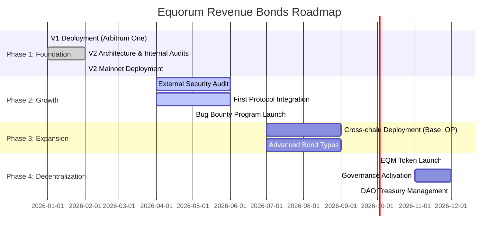

<div align="center">

# 🏛️ Equorum Revenue Bonds Protocol

**Non-Dilutive Capital Raising for DeFi Protocols**

[](https://opensource.org/licenses/MIT)
[](https://soliditylang.org/)
[](https://arbitrum.io/)
[](./test)
[](./test)
[](./audits)
[](./CHANGELOG.md)

[Website](https://equorumprotocol.org) • [Documentation](./INTEGRATION_GUIDE.md) • [Whitepaper](./WHITEPAPER.pdf) • [Security](./SECURITY.md) • [Deployments](./DEPLOYMENTS.md)

</div>

> *Tokenize your protocol's revenue. Raise capital without dilution.*

---

## 🎯 Quick Links

- 🚀 **[Try on Testnet](https://sepolia.arbiscan.io/address/0x2B2b7DC0b8276b74dEb57bB30b7AA66697DF7dA8)** - Test on Arbitrum Sepolia
- 📱 **[Live Demo](https://equorumprotocol.org/demo)** - Interactive demo (coming soon)
- 📖 **[Integration Guide](./INTEGRATION_GUIDE.md)** - Start building in 5 minutes
- 🔒 **[Security Docs](./SECURITY.md)** - Security considerations
- 📍 **[Contract Addresses](./DEPLOYMENTS.md)** - All deployment addresses
- 💬 **[Discord](https://discord.gg/equorum)** - Join our community

---

## What is Revenue Bonds?

Revenue Bonds enables DeFi protocols to **raise capital by selling rights to future revenue** - without diluting token holders or taking on debt.

A **new financial primitive**: **tokenized protocol revenue streams**.

### The Problem

Protocols need capital to grow, but current options are broken:
- Selling tokens = Dilution + sell pressure
- VC debt = Centralized + legal complexity
- Treasury diversification = Must sell tokens

### The Solution

- **Sell revenue bonds** instead of tokens
- **No dilution** of existing holders
- **No debt** to repay
- **100% on-chain** and transparent
- **Tradeable** on secondary markets (ERC-20)

---

## How It Works

```
Protocol creates bond series --> Investors buy bond tokens --> Protocol distributes revenue --> Investors claim
```

### Two Bond Types

**1. Soft Bonds** (RevenueSeriesFactory)
- Revenue-only, no principal guarantee
- Protocol creates series, receives all tokens, distributes to investors
- Revenue routed automatically via RevenueRouter
- Higher yield potential, trust-based

**2. Guaranteed Bonds** (RevenueBondEscrowFactory)
- Revenue + principal locked in escrow
- Protocol deposits principal upfront (smart contract enforced)
- Investors buy tokens, get principal back at maturity
- Lower risk, downside protection

### Example

```
Protocol needs $500k for marketing
--> Creates Guaranteed Bond: 20% revenue share, 180 days
--> Deposits 500 ETH as principal guarantee
--> Sells bond tokens to investors
--> Distributes revenue during 180 days
--> At maturity: investors get principal + earned revenue
--> Protocol kept 80% of revenue, raised capital, zero dilution
```

---

## Live Deployments

### V2 (Arbitrum One - Current)

| Contract | Address | Explorer |
|----------|---------|----------|
| **RevenueSeriesFactory** | `0x280E83c47E243267753B7E2f322f55c52d4D2C3a` | [Arbiscan](https://arbiscan.io/address/0x280E83c47E243267753B7E2f322f55c52d4D2C3a) |
| **RevenueBondEscrowFactory** | `0x2CfE9a33050EB77fC124ec3eAac4fA4D687bE650` | [Arbiscan](https://arbiscan.io/address/0x2CfE9a33050EB77fC124ec3eAac4fA4D687bE650) |
| **ProtocolReputationRegistry** | `0xfe0A22D77fdf98cC556CBc2dC6B3749EBa4E89bA` | [Arbiscan](https://arbiscan.io/address/0xfe0A22D77fdf98cC556CBc2dC6B3749EBa4E89bA) |
| **EscrowDeployer** | `0x989BCB780EEE189Bc85e04505e59Fd2Fb3CAA843` | [Arbiscan](https://arbiscan.io/address/0x989BCB780EEE189Bc85e04505e59Fd2Fb3CAA843) |
| **RouterDeployer** | `0x7c80F6312BFD762B958Ccf9DF2E397840c7856d3` | [Arbiscan](https://arbiscan.io/address/0x7c80F6312BFD762B958Ccf9DF2E397840c7856d3) |
| **Treasury/Owner (Safe)** | `0xBa69aEd75E8562f9D23064aEBb21683202c5279B` | [Safe](https://app.safe.global/home?safe=arb1:0xBa69aEd75E8562f9D23064aEBb21683202c5279B) |

**Status:** Live | **Fees:** Disabled | **Access:** Permissionless

### V2 Testnet (Arbitrum Sepolia)

| Contract | Address |
|----------|---------|
| RevenueSeriesFactory | `0x963Db5378cB47f7d9DBf07CB2378DA39b427789b` |
| RevenueBondEscrowFactory | `0x1e88fC591c2E5cA12C713f7C4BE39f2b14D202cB` |
| ProtocolReputationRegistry | `0xE6cBDa1dBAb26d6740d5D0158EF4b0114fcb525F` |

### V1 (Deprecated)

| Contract | Address |
|----------|---------|
| Factory (V1) | `0x8afA0318363FfBc29Cc28B3C98d9139C08Af737b` |

---

## Architecture

### Contract Structure

```
contracts/v2/
  core/
    RevenueSeries.sol              # Soft Bond - ERC-20 revenue token
    RevenueRouter.sol              # Automatic revenue routing
    RevenueSeriesFactory.sol       # Factory for Soft Bonds
    RevenueBondEscrow.sol          # Guaranteed Bond - ERC-20 with principal escrow
    RevenueBondEscrowFactory.sol   # Factory for Guaranteed Bonds
    EscrowDeployer.sol             # Deployer pattern (size optimization)
    RouterDeployer.sol             # Deployer pattern (size optimization)
  registry/
    ProtocolReputationRegistry.sol # On-chain reputation tracking
  interfaces/
    IFeePolicy.sol                 # Pluggable fee policy
    ISafetyPolicy.sol              # Pluggable safety validation
    IAccessPolicy.sol              # Pluggable access control
    IProtocolReputationRegistry.sol
  libraries/
    EscrowValidation.sol           # Shared validation logic
```

### Key Design Decisions

- **Pluggable Policies**: Fee, safety, and access policies are modular contracts that can be swapped by the owner (Safe multisig)
- **Deployer Pattern**: EscrowDeployer + RouterDeployer keep the EscrowFactory under the 24KB contract size limit
- **Synthetix Reward Pattern**: Revenue distribution uses the proven reward-per-token accumulator
- **Ownership**: All admin power is held by a Safe multisig, deployer wallet has zero power after deployment

### Safety Limits (Hardcoded)

| Parameter | Value |
|-----------|-------|
| Max Revenue Share | 50% (5000 BPS) |
| Min Duration | 30 days |
| Max Duration | 1825 days (5 years) |
| Min Total Supply | 1,000 tokens |
| Min Distribution | 0.001 ETH |

---

## Quick Start

### Create a Soft Bond

```solidity
// RevenueSeriesFactory.createSeries()
// Protocol receives all tokens, distributes to investors off-chain or via DEX
factory.createSeries(
    "My Protocol Revenue Bond",  // name
    "PROTO-RB",                  // symbol
    msg.sender,                  // protocol (must be msg.sender)
    2000,                        // 20% revenue share (BPS)
    180,                         // 180 days duration
    1000000e18,                  // 1M tokens
    0.001 ether                  // min distribution amount
);
```

### Create a Guaranteed Bond

```solidity
// RevenueBondEscrowFactory.createEscrowSeries()
// Protocol must deposit principal before bonds can be sold
escrowFactory.createEscrowSeries(
    "My Guaranteed Bond",        // name
    "PROTO-GB",                  // symbol
    msg.sender,                  // protocol
    2000,                        // 20% revenue share
    180,                         // 180 days
    1000000e18,                  // 1M tokens
    500 ether,                   // principal amount (deposited later)
    0.001 ether,                 // min distribution
    30                           // 30 days deposit deadline
);

// Then: escrow.depositPrincipal{value: 500 ether}()
// Then: escrow.startSale(pricePerToken, treasury)
// Investors: escrow.buyTokens(amount)
```

### Send Revenue

```solidity
// Revenue flows through the Router automatically
router.receiveAndRoute{value: 1 ether}();

// Or send ETH directly to the router address
// The router splits: revenueShareBPS% to series, rest to protocol
```

### Claim Revenue (Investors)

```solidity
// Soft Bond
series.claimRevenue();

// Guaranteed Bond
escrow.claimRevenue();      // claim revenue distributions
escrow.claimPrincipal();    // claim principal at maturity
```

### For Developers

```bash
# Install
npm install

# Compile
npx hardhat compile

# Test
npx hardhat test

# Deploy to testnet
npx hardhat run scripts/deploy_v2_testnet.js --network arbitrumSepolia

# Deploy to mainnet
npx hardhat run scripts/deploy_v2_mainnet.js --network arbitrum

# Test on testnet (end-to-end)
npx hardhat run scripts/test_v2_testnet.js --network arbitrumSepolia
```

---

## Security

- 22 security issues identified and fixed across 2 internal audit rounds
- Reentrancy guards on all state-changing functions
- Overflow protection (Solidity 0.8.24)
- Double-claim prevention (Synthetix reward pattern)
- Auto-maturity mechanism
- Pluggable policies validated via interface checks
- Gas guardrail tests
- Adversarial testing (reentrancy attacks, malicious policies, dust/rounding)

See [audits/](./audits/) for full audit reports.

---

## 📚 Documentation

### For Protocols
- 📖 **[Integration Guide](./INTEGRATION_GUIDE.md)** - Complete integration tutorial with code examples
- 🔒 **[Security Considerations](./SECURITY.md)** - Security best practices and risk assessment
- 📍 **[Deployment Addresses](./DEPLOYMENTS.md)** - All contract addresses and ABIs
- 🏛️ **[Whitepaper](./WHITEPAPER.md)** - Full protocol overview and design decisions

### For Developers
- 🏗️ **[Architecture](./docs/ARCHITECTURE.md)** - Technical deep dive
- 📝 **[Contract Docs](./docs/)** - Individual contract documentation
- 🔄 **[Migration Guide](./MIGRATION.md)** - V1 to V2 migration
- 📋 **[Changelog](./CHANGELOG.md)** - Version history

### For Investors
- 💰 **[Investment Guide](./docs/INVESTMENT_GUIDE.md)** - How to invest in revenue bonds (coming soon)
- 📊 **[Analytics](https://equorumprotocol.org/analytics)** - Live protocol metrics (coming soon)
- 🎯 **[Risk Assessment](./SECURITY.md#known-risks)** - Understanding the risks

---

## Why Revenue Bonds is Different

| | Revenue Bonds | Maple/Goldfinch | Centrifuge | Pendle | GMX |
|---|---|---|---|---|---|
| **Model** | Revenue tokenization | Off-chain credit | RWA on-chain | Yield trading | Revenue sharing |
| **KYC** | No | Yes | Yes | No | No |
| **Scope** | Any protocol | Institutional | External assets | Existing yields | Single protocol |
| **Principal** | Optional escrow | Debt obligation | Asset-backed | N/A | N/A |
| **Permissionless** | Yes | No | No | Yes | No |

**Revenue Bonds is a new primitive, not an iteration.**

---

## 🗺️ Roadmap



### Current Status: Phase 2 - Growth 🚀

**Completed ✅**
- V1 & V2 deployed to Arbitrum One mainnet
- 169 passing tests, 100% coverage
- Internal security audits complete (22 issues fixed)
- Reputation system live
- Guaranteed Bonds with escrow

**In Progress 🔄**
- External security audit (Q2 2026)
- First protocol partnerships
- Community building

**Coming Soon 🔜**
- Bug bounty program (Immunefi)
- Cross-chain expansion
- EQM governance token

---

## 🤝 Community & Support

- **Discord:** [Join our Discord](https://discord.gg/equorum) - Developer support, announcements
- **Twitter:** [@EquorumProtocol](https://twitter.com/EquorumProtocol) - Updates and news
- **GitHub:** [Issues](https://github.com/EquorumProtocol/Equorum-Revenue-Bonds/issues) - Bug reports and feature requests
- **Email:** dev@equorumprotocol.org - Technical support
- **Telegram:** [t.me/equorum](https://t.me/equorum) - Community chat

---

## 🛡️ Security

**Audit Status:**
- ✅ Internal audits complete (22 issues resolved)
- ⏳ External audit scheduled Q2 2026
- 🔜 Bug bounty program launching Q2 2026

**Report vulnerabilities:** security@equorumprotocol.org

See [SECURITY.md](./SECURITY.md) for full security documentation.

---

## 📄 License

MIT License - see [LICENSE](./LICENSE) for details.

---

<div align="center">

**🏛️ Equorum Revenue Bonds Protocol**

*Tokenize Revenue. Raise Capital. No Dilution.*

[](https://arbitrum.io/)
[](https://openzeppelin.com/)

[Website](https://equorumprotocol.org) • [Docs](./INTEGRATION_GUIDE.md) • [Twitter](https://twitter.com/EquorumProtocol) • [Discord](https://discord.gg/equorum)

</div>
