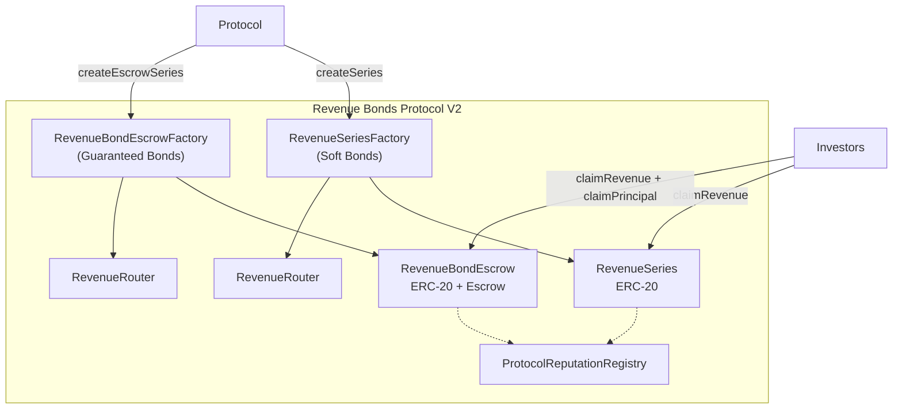
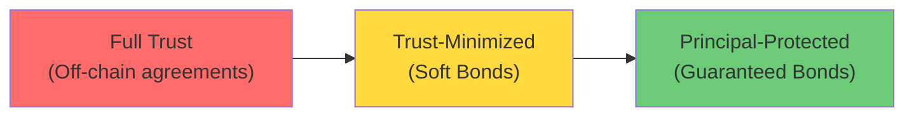
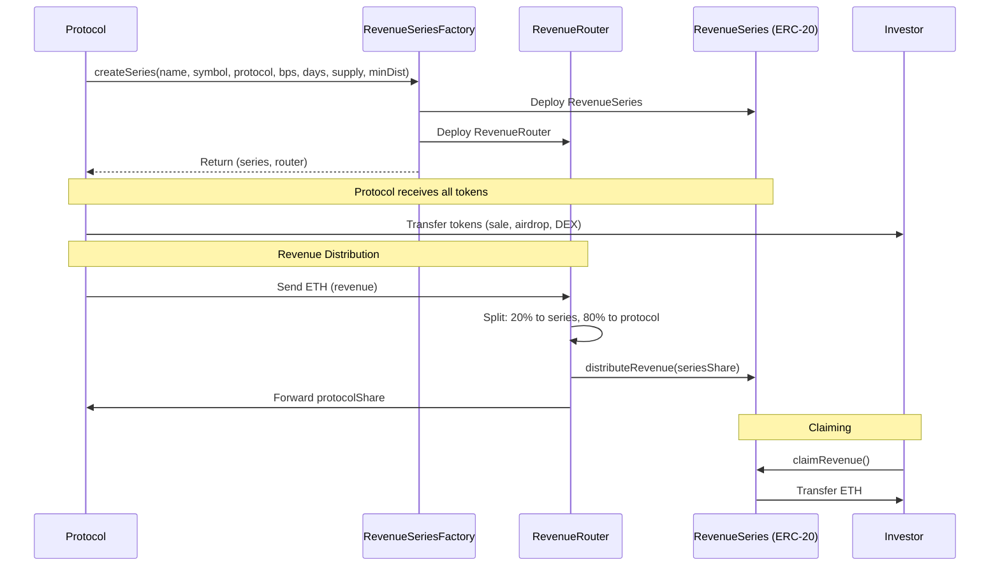
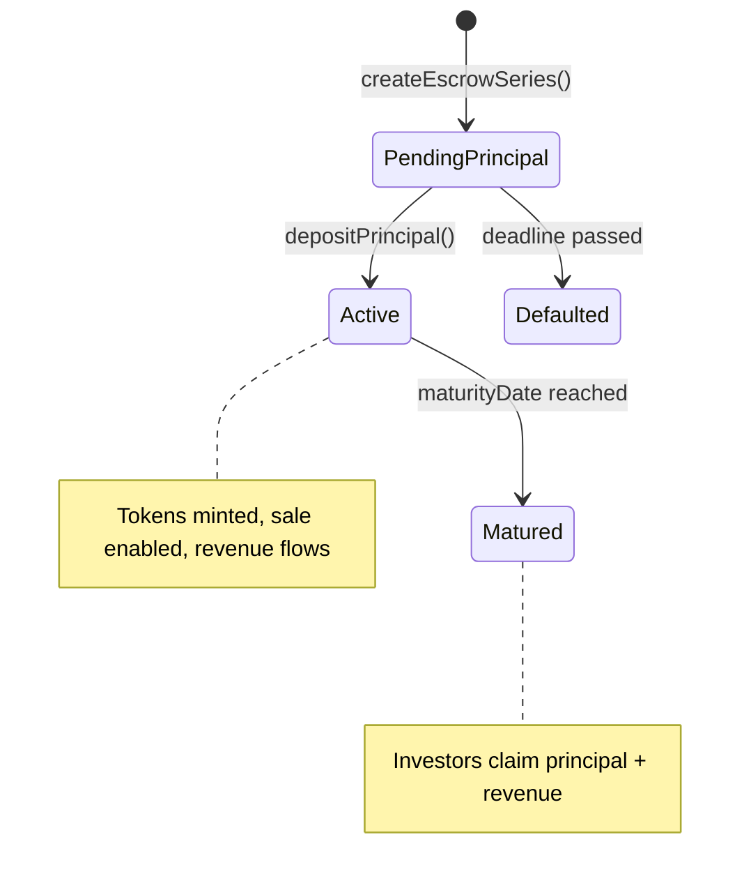
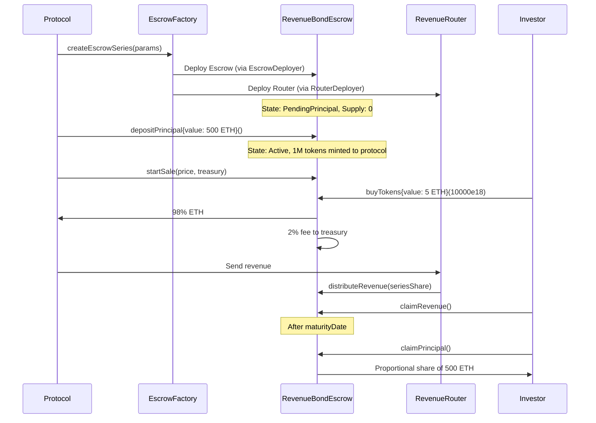
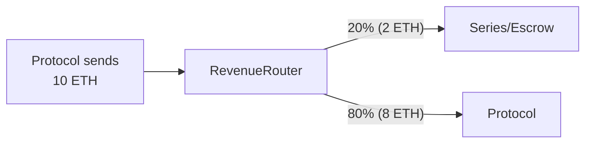
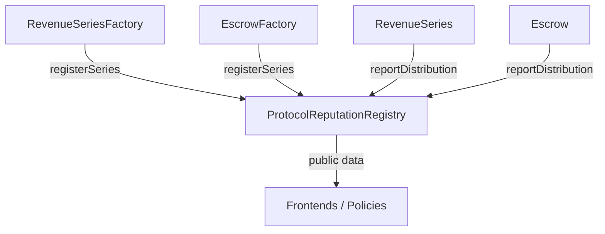
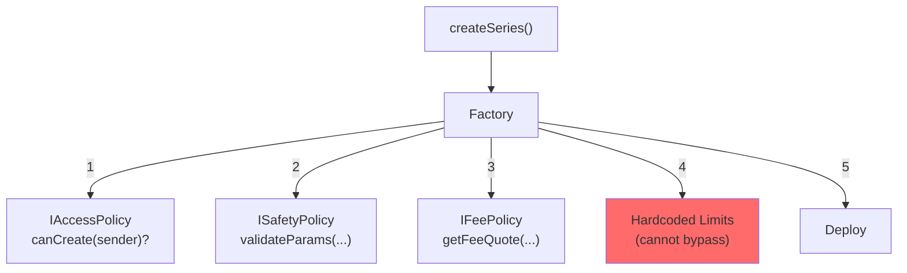
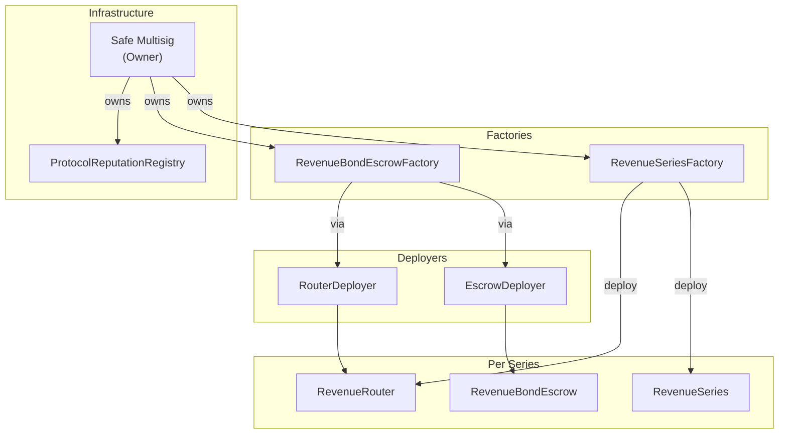
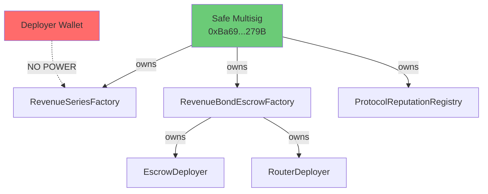

# Revenue Bonds Protocol - Whitepaper V2

**Version 2.0 - February 2026**

**Network:** Arbitrum One (Mainnet)  
**Website:** https://equorumprotocol.org

---

## Table of Contents

1. [Introduction](#introduction)
2. [The Problem](#the-problem)
3. [The Solution: Two Bond Types](#the-solution-two-bond-types)
4. [Soft Bonds](#soft-bonds)
5. [Guaranteed Bonds](#guaranteed-bonds)
6. [Revenue Routing](#revenue-routing)
7. [Protocol Reputation System](#protocol-reputation-system)
8. [Pluggable Policy Architecture](#pluggable-policy-architecture)
9. [Technical Architecture](#technical-architecture)
10. [Security Model](#security-model)
11. [Example Use Cases](#example-use-cases)
12. [Getting Started](#getting-started)
13. [FAQ](#faq)
14. [Contract Addresses](#contract-addresses)
15. [Disclaimer](#disclaimer)

---

## Introduction

**Revenue Bonds Protocol** is a permissionless framework for tokenizing revenue-sharing agreements on-chain.

Any protocol can create a **Revenue Bond Series** (ERC-20) plus a **Revenue Router**, deposit revenue periodically, and holders claim their proportional share trustlessly. Creation is self-issued: `protocol == msg.sender`.

V2 introduces two distinct bond types, an on-chain reputation system, and a modular policy architecture.



### What's New in V2

- **Dual Bond Model**: Soft Bonds (revenue-only) and Guaranteed Bonds (revenue + principal escrow)
- **On-chain Reputation**: ProtocolReputationRegistry tracks payment history
- **Pluggable Policies**: Modular fee, safety, and access control
- **Deployer Pattern**: EscrowFactory stays under 24KB via EscrowDeployer + RouterDeployer
- **22 Security Fixes**: Two internal audit rounds

### What This Protocol Is NOT

- **Not a stablecoin** - Revenue Bonds are not pegged to any value
- **Not a guarantee of yield** - Revenue depends entirely on the issuing protocol
- **Not a legal wrapper** - This is not equity, debt, or a regulated security instrument
- **Not an oracle of revenue** - The protocol cannot verify if the correct percentage is sent
- **Not a lending protocol** - No borrowing, liquidations, or collateral involved
- Regulatory classification may vary by jurisdiction

**What it IS:** Infrastructure for transparent, on-chain accounting and distribution of voluntarily deposited revenue.

---

## The Problem

### For Protocols

| Option | Problem |
|--------|---------|
| Sell tokens | Dilution + sell pressure |
| VC debt | Centralized + legal complexity |
| Treasury diversification | Must sell tokens |
| Revenue sharing (off-chain) | Manual, opaque, no secondary market |

### For Investors

- **Opacity**: No way to verify actual revenue or distributions
- **Illiquidity**: Locked in until agreement ends
- **High minimums**: Small investors excluded
- **Trust dependency**: No enforcement mechanism

### The Trust Spectrum



V2 addresses the full spectrum: Soft Bonds for established protocols, Guaranteed Bonds for new protocols building trust.

---

## The Solution: Two Bond Types

| Feature | Soft Bond | Guaranteed Bond |
|---------|-----------|-----------------|
| **Principal** | None | Locked in escrow |
| **Risk profile** | Higher (trust-based) | Lower (principal protected) |
| **Token minting** | At creation | After principal deposit |
| **Sale mechanism** | Off-chain / DEX | Built-in buyTokens() |
| **State machine** | Active -> Matured | PendingPrincipal -> Active -> Matured |
| **Best for** | Established protocols | New protocols |
| **Factory** | RevenueSeriesFactory | RevenueBondEscrowFactory |

---

## Soft Bonds

### Flow



### Example: CoffeeDAO

CoffeeDAO wants to share 20% of revenue for 1 year:

```solidity
factory.createSeries(
    "CoffeeDAO Revenue 2026", "COFFEE-REV",
    msg.sender, 2000, 365, 1000000e18, 0.001 ether
);
```

- Protocol receives 1M COFFEE-REV tokens
- Distributes via sale, airdrop, DEX
- Monthly: sends revenue to router
- Router splits 20% to series, 80% back to protocol
- Alice holds 10,000 tokens (1%): claims 1% of each distribution

### Revenue Accounting (Synthetix Pattern)

```solidity
uint256 public revenuePerTokenStored;
mapping(address => uint256) public userRevenuePerTokenPaid;
mapping(address => uint256) public revenueRewards;

// On distribution: revenuePerTokenStored += (amount * 1e18) / totalSupply
// On claim: owed = balance * (revenuePerTokenStored - userRevenuePerTokenPaid[user]) / 1e18
```

Correctly handles token transfers, multiple distributions, and new holders.

---

## Guaranteed Bonds

### State Machine



### Flow



### Example: NewProtocol

```solidity
// 1. Create
escrowFactory.createEscrowSeries(
    "NewProtocol Guaranteed Bond", "NEWP-GB",
    msg.sender, 2000, 180, 1000000e18, 500 ether, 0.001 ether, 30
);

// 2. Deposit principal (activates series, mints tokens)
escrow.depositPrincipal{value: 500 ether}();

// 3. Sell tokens
escrow.startSale(0.0005 ether, treasuryAddress);

// 4. Investor buys 100K tokens for 50 ETH
escrow.buyTokens{value: 50 ether}(100000e18);

// 5. At maturity: investor claims 10% of 500 ETH = 50 ETH principal + revenue
escrow.claimPrincipal();
escrow.claimRevenue();
```

### Principal Redemption

```
claimable = (principalAmount * balanceOf(user)) / totalTokenSupply
```

Each address claims once. Principal is locked in contract - protocol cannot withdraw.

### Sale Mechanism

2% fee hardcoded: 98% to protocol, 2% to treasury. Protocol controls start/stop.

---

## Revenue Routing

Both bond types use the same RevenueRouter:



| Scenario | Behavior |
|----------|----------|
| Series active | Split and distribute |
| Series matured | Return 100% to protocol |
| Series inactive (PendingPrincipal) | Hold as pending |
| Distribution fails | Increment failedRouteCount |

---

## Protocol Reputation System



### Data Tracked Per Protocol

- Total series created
- Revenue promised vs delivered
- On-time vs late payments
- Last payment timestamp
- Blacklist status

### Score Calculation (Off-chain)

```
deliveryRatio = totalRevenueDelivered / totalRevenuePromised
punctualityScore = onTimePayments / (onTimePayments + latePayments)
```

### Expected Cadence

| Duration | Expected Frequency |
|----------|-------------------|
| > 180 days | Monthly (30 days) |
| <= 180 days | Weekly (7 days) |

### Limitations

- Cannot verify actual protocol revenue (no oracle)
- Score is a heuristic, not absolute truth
- Useful for trust-building, not trustless enforcement

---

## Pluggable Policy Architecture



### Three Policy Types

**Fee Policy** (`IFeePolicy`): Calculate creation fees dynamically.
```solidity
function getFeeQuote(...) external view returns (uint256 fee, address feeReceiver);
```

**Safety Policy** (`ISafetyPolicy`): Additional parameter validation. Can only restrict further, never relax hardcoded limits.
```solidity
function validateParams(...) external view; // reverts if invalid
```

**Access Policy** (`IAccessPolicy`): Control who can create series.
```solidity
function canCreate(address sender) external view returns (bool);
```

**Current state:** All `address(0)` (disabled). Protocol is fully permissionless.

---

## Technical Architecture

### Contract Map



### Deployer Pattern

EscrowFactory (5.9 KB) calls EscrowDeployer (14.2 KB) and RouterDeployer (5.8 KB) to stay under 24KB limit. Both deployers are owned by the factory.

### Safety Limits (Hardcoded)

| Parameter | Min | Max |
|-----------|-----|-----|
| Revenue Share | 1 BPS | 5000 BPS (50%) |
| Duration | 30 days | 1825 days (5 years) |
| Total Supply | 1,000 tokens | No max |
| Min Distribution | 0.001 ETH | No max |
| Deposit Deadline | 1 day | 90 days |

### Ownership



Deployer wallet has zero power after deployment.

---

## Security Model

### Audit Status

- **Internal:** 2 rounds, 22 issues fixed (12 Critical, 7 Medium, 3 Low)
- **External:** Planned Q2 2026

### Protections

- Solidity 0.8.24 overflow protection
- ReentrancyGuard on all state-changing functions
- Synthetix pattern prevents double-claim
- Hardcoded limits cannot be bypassed
- Interface validation on policy contracts
- Immutable series parameters
- Pull-based claims (no push-payment failures)

### Threat Model

| Threat | Mitigation | Residual Risk |
|--------|------------|---------------|
| Smart contract bug | 2 audit rounds, open source | Medium |
| Issuer doesn't pay | Reputation system, Guaranteed Bonds | High (Soft), Low (Guaranteed) |
| Reentrancy | ReentrancyGuard | Low |
| Overflow | Solidity 0.8.24 | Very Low |
| Malicious policy | Interface validation, owner-only | Low |
| Principal theft | Locked in contract, no withdrawal | Very Low |

### Trust Assumptions

**Soft Bonds:** Trust that protocol sends revenue. Distribution is trustless once deposited.

**Guaranteed Bonds:** Principal is cryptographically enforced. Revenue honesty is still trust-based.

---

## Example Use Cases

All examples are hypothetical.

### Example 1: Established DEX (Soft Bond)

```
SwapHub: 0.3% fee, $100M monthly volume
Bond: 25% share, 90 days, 1M tokens
Revenue: ~25 ETH/month to series
Holder (1%): 0.25 ETH/month ($750)
```

### Example 2: New Protocol (Guaranteed Bond)

```
NewDEX: Launching, needs to build trust
Bond: 20% share, 180 days, 1M tokens, 500 ETH principal
Investors buy tokens, get principal back at maturity
Revenue: bonus on top of principal return
```

### Example 3: NFT Marketplace (Soft Bond)

```
ArtChain: 2.5% fee, $5M monthly volume
Bond: 40% share, 365 days, 50K tokens
Revenue: ~16.67 ETH/month
Holder (1%): 0.167 ETH/month ($500)
```

### Example 4: GameFi (Guaranteed Bond)

```
CryptoQuest: In-game purchases, $200K/month
Bond: 30% share, 365 days, 100K tokens, 200 ETH principal
Investors get principal + 30% of revenue
Lower risk entry for gaming investors
```

### Example 5: DAO Treasury Yield

```
BuilderDAO: $2M treasury, 5% APY
Bond: 50% share, 365 days, 10K tokens
Revenue: ~16.67 ETH/year to series
Members earn yield from DAO treasury
```

---

## Getting Started

### For Protocols

1. **Choose bond type**: Soft (no principal) or Guaranteed (with escrow)
2. **Set parameters**: Revenue share (1-50%), duration (30-1825 days), supply
3. **Create series** via https://equorumprotocol.org or directly on-chain
4. **Distribute tokens** (Soft) or **deposit principal then sell** (Guaranteed)
5. **Send revenue** to router address periodically

### For Investors

1. **Research** the protocol and bond terms
2. **Buy tokens** from protocol, DEX, or built-in sale (Guaranteed)
3. **Hold tokens** - revenue accrues automatically
4. **Claim revenue** anytime via app or contract
5. **Claim principal** at maturity (Guaranteed bonds only)

### For Developers

```bash
npm install
npx hardhat compile
npx hardhat test
npx hardhat run scripts/deploy_v2_testnet.js --network arbitrumSepolia
npx hardhat run scripts/deploy_v2_mainnet.js --network arbitrum
```

See [docs/INTEGRATION.md](./docs/INTEGRATION.md) for full integration guide.

---

## FAQ

**Q: What is a Revenue Bond?**
A: An ERC-20 token representing a right to receive a share of a protocol's revenue.

**Q: What's the difference between Soft and Guaranteed?**
A: Soft Bonds are revenue-only (trust-based). Guaranteed Bonds lock principal in escrow (principal-protected).

**Q: Can I sell my tokens?**
A: Yes, they're standard ERC-20. Trade on any DEX.

**Q: What if the protocol doesn't pay?**
A: Soft Bonds: you lose expected revenue. Guaranteed Bonds: you still get your principal back at maturity.

**Q: How much does it cost to create a series?**
A: Only gas fees. No protocol fees currently (policies disabled).

**Q: Can parameters be changed after creation?**
A: No. Revenue share, duration, supply, and principal are immutable.

**Q: What happens at maturity?**
A: No more revenue distributed. Holders claim remaining revenue. Guaranteed Bond holders also claim principal.

**Q: Is the code audited?**
A: Two internal audit rounds completed (22 fixes). External audit planned Q2 2026.

**Q: Who controls the protocol?**
A: Safe multisig (`0xBa69...279B`). Deployer wallet has zero power.

**Q: Can the protocol be paused?**
A: The Safe can pause new series creation. Existing series continue operating.

---

## Contract Addresses

### V2 - Arbitrum One (Mainnet)

| Contract | Address | Arbiscan |
|----------|---------|----------|
| RevenueSeriesFactory | `0x280E83c47E243267753B7E2f322f55c52d4D2C3a` | [Link](https://arbiscan.io/address/0x280E83c47E243267753B7E2f322f55c52d4D2C3a) |
| RevenueBondEscrowFactory | `0x2CfE9a33050EB77fC124ec3eAac4fA4D687bE650` | [Link](https://arbiscan.io/address/0x2CfE9a33050EB77fC124ec3eAac4fA4D687bE650) |
| ProtocolReputationRegistry | `0xfe0A22D77fdf98cC556CBc2dC6B3749EBa4E89bA` | [Link](https://arbiscan.io/address/0xfe0A22D77fdf98cC556CBc2dC6B3749EBa4E89bA) |
| EscrowDeployer | `0x989BCB780EEE189Bc85e04505e59Fd2Fb3CAA843` | [Link](https://arbiscan.io/address/0x989BCB780EEE189Bc85e04505e59Fd2Fb3CAA843) |
| RouterDeployer | `0x7c80F6312BFD762B958Ccf9DF2E397840c7856d3` | [Link](https://arbiscan.io/address/0x7c80F6312BFD762B958Ccf9DF2E397840c7856d3) |
| Treasury/Owner (Safe) | `0xBa69aEd75E8562f9D23064aEBb21683202c5279B` | [Link](https://arbiscan.io/address/0xBa69aEd75E8562f9D23064aEBb21683202c5279B) |

### V2 - Arbitrum Sepolia (Testnet)

| Contract | Address |
|----------|---------|
| RevenueSeriesFactory | `0x963Db5378cB47f7d9DBf07CB2378DA39b427789b` |
| RevenueBondEscrowFactory | `0x1e88fC591c2E5cA12C713f7C4BE39f2b14D202cB` |
| ProtocolReputationRegistry | `0xE6cBDa1dBAb26d6740d5D0158EF4b0114fcb525F` |

### V1 (Deprecated)

| Contract | Address |
|----------|---------|
| Factory (V1) | `0x8afA0318363FfBc29Cc28B3C98d9139C08Af737b` |

---

## Links & Resources

**Website:** https://equorumprotocol.org
**GitHub:** https://github.com/EquorumProtocol/Equorum-Revenue-Bonds
**Discord:** https://discord.gg/nYMuD8By
**Twitter:** [@Equorumprotocol](https://x.com/Equorumprotocol)
**Reddit:** [r/EquorumProtocol](https://www.reddit.com/r/EquorumProtocol/)

---

## Disclaimer

1. **Experimental Technology:** This protocol has undergone internal audits but not a formal external audit. Use at your own risk.
2. **No Guarantees:** There are no guarantees of revenue, returns, or token value.
3. **Not Financial Advice:** This whitepaper is for informational purposes only.
4. **Regulatory Uncertainty:** Revenue sharing tokens may be subject to securities regulations. Consult legal counsel.
5. **Smart Contract Risk:** Bugs or vulnerabilities could result in loss of funds.
6. **No Liability:** The protocol developers assume no liability for losses.
7. **Examples Are Hypothetical:** All examples are for illustration only.

---

## Conclusion

Revenue Bonds Protocol V2 provides two complementary primitives for on-chain revenue sharing:

- **Soft Bonds** for established protocols with proven track records
- **Guaranteed Bonds** for new protocols that need to build trust with principal protection

Combined with the on-chain reputation system and pluggable policy architecture, V2 creates a foundation for a permissionless capital-raising ecosystem where protocols can raise funds without dilution and investors can earn revenue with varying levels of risk protection.

**The future of revenue sharing is on-chain.**

---

**Version:** 2.0
**Last Updated:** February 2026
**License:** MIT
