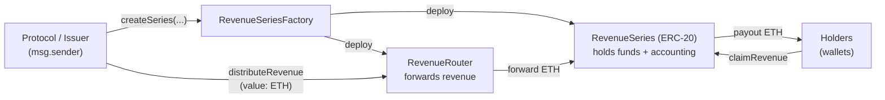
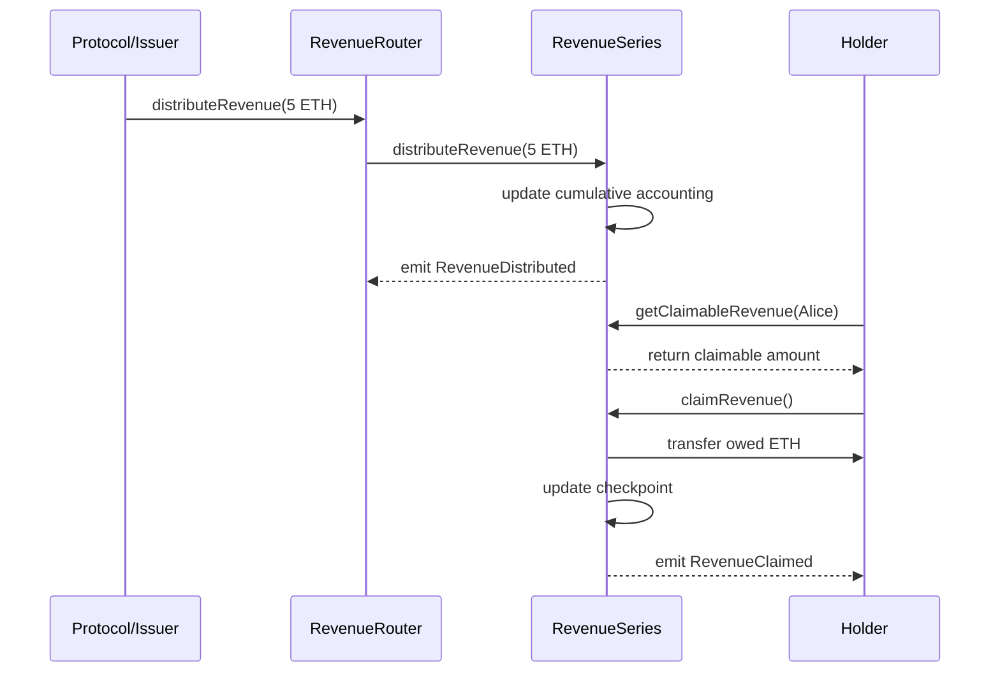

# Revenue Bonds Protocol - Whitepaper

**Version 1.0 - January 2026**

**Network:** Arbitrum One (Mainnet)  
**Factory Contract:** `0x8afA0318363FfBc29Cc28B3C98d9139C08Af737b`  
**Website:** https://equorumprotocol.org  
**App:** https://app.equorumprotocol.org

---

## Table of Contents

1. [Introduction](#introduction)
2. [The Problem](#the-problem)
3. [The Solution](#the-solution)
4. [How It Works](#how-it-works)
5. [Technical Architecture](#technical-architecture)
6. [Example Use Cases](#example-use-cases)
7. [Security & Safety](#security--safety)
8. [Getting Started](#getting-started)
9. [FAQ](#faq)
10. [Contract Addresses](#contract-addresses)

---

## Introduction

**Revenue Bonds Protocol** is a permissionless framework for tokenizing revenue-sharing agreements on-chain.

Permissionless: any address can create a series for itself (self-issued), enforced by `protocol == msg.sender`.

Projects create a **Revenue Series** (ERC-20) plus a **Router**, deposit revenue periodically, and holders claim their proportional share trustlessly.

Think of it as a **revenue distribution primitive** for on-chain protocols. Instead of traditional equity or complex legal agreements, projects can create **Revenue Bonds** - special tokens that represent a right to claim a share of deposited revenue.

### What Makes It Special?

- ✅ **Transparent:** All revenue distributions are on-chain and verifiable
- ✅ **Automated accounting:** Smart contracts handle claim calculations automatically
- ✅ **Trust-minimized:** Once revenue is deposited, distribution is trustless
- ✅ **Flexible:** Works for any project that generates revenue
- ✅ **Fair:** Revenue is distributed proportionally to all holders

---

### What This Protocol Is NOT

To set clear expectations:

- ❌ **Not a stablecoin** - Revenue Bonds are not pegged to any value
- ❌ **Not a guarantee of yield** - Revenue depends entirely on the issuing protocol
- ❌ **Not a legal wrapper** - This is not equity, debt, or a regulated security instrument
- ❌ **Not an offering** - This document is not an offering or solicitation
- ⚠️ **Regulatory classification may vary by jurisdiction**
- ❌ **Not an oracle of revenue** - The protocol cannot verify if the correct percentage is sent
- ❌ **Not a lending protocol** - No borrowing, liquidations, or collateral involved

**What it IS:** Infrastructure for transparent, on-chain accounting and distribution of voluntarily deposited revenue.

---

## The Problem

Traditional revenue sharing has several challenges:

### 1. **Lack of Transparency**
In traditional finance, investors often don't know:
- How much revenue the company is actually making
- When distributions will happen
- If they're getting their fair share

### 2. **Manual Processes**
Revenue distribution requires:
- Accounting teams to calculate shares
- Payment processors to send money
- Legal agreements to enforce terms
- Trust that everyone will follow the rules

### 3. **High Barriers to Entry**
Small investors are often excluded because:
- Minimum investment amounts are too high
- Legal costs make small distributions unprofitable
- Legal/operational restrictions limit participation

### 4. **No Secondary Market**
Once you invest in a revenue-sharing agreement:
- You're locked in until the agreement ends
- You can't sell your position to someone else
- You can't exit early if you need liquidity

---

## The Solution

Revenue Bonds Protocol solves these problems by bringing revenue sharing on-chain:

### 1. **Complete Transparency**
- Every revenue distribution is recorded on the blockchain
- Anyone can verify the amounts and timing
- No hidden fees or unclear calculations

### 2. **Automated Accounting & Payout Logic**
- Smart contracts handle all claim calculations
- Once revenue is deposited, distribution logic is automatic
- No manual calculations or tracking needed

### 3. **Permissionless to Use**
- No minimum investment (buy as little as 1 token)
- Permissionless to use (subject to local laws)
- Standard ERC-20 tokens

### 4. **Liquid & Tradeable**
- Revenue Bonds are ERC-20 tokens
- Can be traded on any DEX (Uniswap, etc.)
- Exit anytime by selling your tokens

---

## How It Works

### Protocol Flow Diagram

High-level flow of contracts and funds:



---

### Revenue Accounting Flow

How the pull-based claim model works:



---

Let's break down the entire process step by step:

### Step 1: Create a Revenue Bond Series

A project (let's call it **"CoffeeDAO"**) wants to share 30% of its coffee shop revenue with the community.

**CoffeeDAO creates a Revenue Bond Series:**
- **Name:** "CoffeeDAO Revenue Series 2026"
- **Symbol:** "COFFEE-REV"
- **Revenue Share:** 30%
- **Duration:** 365 days (1 year)
- **Total Supply:** 1,000,000 tokens (1,000,000 * 10^18 base units, 18 decimals)

**What happens:**
1. CoffeeDAO connects their wallet to https://app.equorumprotocol.org
2. Fills out the creation form
3. Pays a small gas fee on Arbitrum (L2)
4. Two smart contracts are deployed:
   - **RevenueSeries:** The ERC-20 token (COFFEE-REV)
   - **RevenueRouter:** The distribution mechanism
5. CoffeeDAO receives the full supply (`1,000,000 * 10^18` units), shown as 1,000,000 COFFEE-REV tokens in standard wallets

**Cost:** Only gas fees (no protocol fees currently)

---

### Step 2: Distribute Tokens to the Community

CoffeeDAO now has 1,000,000 COFFEE-REV tokens. They decide how to distribute them:

**Example Distribution:**
- **400,000 tokens (40%):** Public sale at 0.01 ETH each
- **300,000 tokens (30%):** Airdrop to loyal customers
- **200,000 tokens (20%):** Staking rewards for governance token holders
- **100,000 tokens (10%):** Team reserve

**How to distribute:**
- **Via Wallet:** Use any EVM wallet (Rabby, MetaMask, Safe, etc.) to transfer tokens
- **Via Code:** Use a script to batch-send tokens
- **Via DEX:** Create a liquidity pool for public trading

**Result:** Community members now hold COFFEE-REV tokens

---

### Step 3: Generate Revenue

CoffeeDAO operates 5 coffee shops. Each month, they generate revenue:

**Month 1 Revenue:**
- Shop 1: $10,000
- Shop 2: $8,000
- Shop 3: $12,000
- Shop 4: $9,000
- Shop 5: $11,000
- **Total:** $50,000

**Revenue to distribute (30%):** $15,000

Let's say ETH is $3,000, so $15,000 = **5 ETH**

---

### Step 4: Distribute Revenue

At the end of the month, CoffeeDAO distributes the revenue:

**Via Interface:**
1. Go to https://app.equorumprotocol.org
2. Find "CoffeeDAO Revenue Series 2026"
3. Click "Distribute Revenue"
4. Enter amount: 5 ETH
5. Confirm transaction

**Via Code (Automated):**
```javascript
const router = await ethers.getContractAt("RevenueRouter", routerAddress)
await router.distributeRevenue({ value: ethers.parseEther("5.0") })
```

**What happens internally:**
1. 5 ETH is sent through the RevenueRouter
2. The Series updates cumulative accounting: 5 ETH ÷ 1,000,000 tokens = 0.000005 ETH per token
3. An on-chain event is emitted for indexing

**Important Notes:**
- Revenue is accounted on-chain and remains held by the series until claimed
- The Router is non-custodial: funds are forwarded to the Series for accounting and custody
- The protocol cannot force a project to send revenue; the bond is a trust-minimized distribution mechanism once revenue is deposited
- The revenue share percentage (30%) is a promise, not cryptographically enforced
- Due to integer division, tiny rounding dust may remain in the contract over time
- Implementations may optionally track and carry dust forward to future distributions

---

### Step 5: Holders Claim Their Revenue

Now anyone holding COFFEE-REV tokens can claim their share:

**Example: Alice holds 10,000 COFFEE-REV tokens (1% of supply)**

**Via Interface:**
1. Alice goes to https://app.equorumprotocol.org
2. Connects her wallet
3. Sees: "You have 0.05 ETH to claim"
4. Clicks "Claim Revenue"
5. Receives 0.05 ETH in her wallet

**Calculation:**
- 10,000 tokens × 0.000005 ETH per token = **0.05 ETH**
- At $3,000/ETH = **$150**

**Via Code:**
```javascript
const series = await ethers.getContractAt("RevenueSeries", seriesAddress)
await series.claimRevenue()
```

**Important Notes:**
- Alice can claim anytime (no deadline)
- If she doesn't claim this month, it accumulates
- Next month's distribution adds to her claimable amount
- She only pays gas to claim (low L2 fees)

---

### Step 6: Repeat Monthly

Every month, CoffeeDAO distributes revenue:

**Month 2:** 6 ETH distributed
- Alice can now claim: 0.05 ETH (Month 1) + 0.06 ETH (Month 2) = 0.11 ETH

**Month 3:** 4 ETH distributed
- Alice can now claim: 0.11 ETH + 0.04 ETH = 0.15 ETH

**And so on for 12 months...**

---

### Step 7: Series Ends

After 365 days, the series ends:

**What happens:**
- No more revenue can be distributed to this series
- Holders can still claim any unclaimed revenue
- Tokens become "historical" (no longer active)
- CoffeeDAO can create a new series for the next year

**What doesn't happen:**
- Tokens don't get burned
- Holders don't lose unclaimed revenue
- The contract doesn't self-destruct

---

## Technical Architecture

### Smart Contracts

The protocol consists of 3 main contracts:

#### 1. RevenueSeriesFactory

**Purpose:** Creates new Revenue Bond series

**Key Functions:**
```solidity
function createSeries(
    string memory name,
    string memory symbol,
    address protocol,
    uint256 revenueShareBPS,
    uint256 durationDays,
    uint256 totalSupply
) external returns (address series, address router)
```

**Parameters:**
- `name`: Name of the series (e.g., "CoffeeDAO Revenue Series 2026")
- `symbol`: Token symbol (e.g., "COFFEE-REV")
- `protocol`: Address of the protocol creating the series (must equal msg.sender)
- `revenueShareBPS`: Revenue share in basis points (3000 = 30%)
- `durationDays`: Series is active until startTime + durationDays, where startTime = block.timestamp at deployment
- `totalSupply`: Total tokens in base units (18 decimals). Example: 1M tokens = `1,000,000 * 10^18`

**Safety Limits:**
- Revenue share: 1% - 50% (100-5000 BPS)
- Duration: 30 days - 5 years (30-1825 days)
- Total supply: Minimum 1,000 tokens (i.e., `1,000 * 10^18` units)

---

#### 2. RevenueSeries (ERC-20 Token)

**Purpose:** The actual Revenue Bond token

**Key Functions:**
```solidity
// Standard ERC-20 functions
function transfer(address to, uint256 amount) external returns (bool)
function balanceOf(address account) external view returns (uint256)

// Revenue-specific functions
function claimRevenue() external returns (uint256)
function getClaimableRevenue(address holder) external view returns (uint256)
```

**How Revenue Tracking Works:**
```solidity
// Each holder has a "checkpoint" of when they last claimed
mapping(address => uint256) public lastClaimPerToken;

// Global cumulative revenue per token
uint256 public cumulativeRevenuePerToken;

// When claiming:
uint256 owed = balance × (cumulativeRevenuePerToken - lastClaimPerToken[holder])
```

**Example:**
```
Alice has 10,000 tokens
Last claim checkpoint: 0.000005 ETH per token
Current cumulative: 0.000015 ETH per token

Owed = 10,000 × (0.000015 - 0.000005) = 10,000 × 0.00001 = 0.1 ETH
```

---

#### 3. RevenueRouter

**Purpose:** Facilitates revenue distribution

**Key Functions:**
```solidity
function distributeRevenue() external payable
function routeRevenue() external  // Anyone can trigger routing
function getRouterStatus() external view returns (...)  // Check router state
```

**Distribution History:**
Distribution history is typically reconstructed off-chain by indexing `RevenueReceived` and `RevenueRouted` events (recommended approach).

**How Distribution Works:**
```solidity
function distributeRevenue() external payable {
    require(msg.value > 0, "No revenue sent");
    
    // Forward to series contract for accounting
    series.distributeRevenue{value: msg.value}();
    
    emit RevenueDistributed(msg.value, block.timestamp);
}
```

---

### Security Features

#### 1. Reentrancy Protection
All functions that transfer ETH use `ReentrancyGuard`:
```solidity
function claimRevenue() external nonReentrant returns (uint256)
```

#### 2. Pausable Factory
Owner can pause series creation in emergencies:
```solidity
function pause() external onlyOwner
function unpause() external onlyOwner
```

#### 3. Safe Math
All calculations use Solidity 0.8+ built-in overflow protection

#### 4. Access Control
- Issuer-only creation: the factory enforces `protocol == msg.sender` (issuer creates only for itself)
- Only series contract can update revenue tracking
- Only holders can claim their own revenue

#### 5. Immutable Parameters
Once a series is created, core parameters cannot be changed:
- Revenue share percentage
- Duration
- Total supply

---

### Events & Indexing

For developers building integrations or analytics:

#### Factory Events
```solidity
event SeriesCreated(
    address indexed series,
    address indexed router,
    address indexed protocol,
    string name,
    string symbol,
    uint256 revenueShareBPS,
    uint256 durationDays,
    uint256 totalSupply
)
```

#### Series Events
```solidity
event RevenueDistributed(uint256 amount, uint256 timestamp)
event RevenueClaimed(address indexed holder, uint256 amount)
```

#### Router Events
```solidity
event RevenueDistributed(uint256 amount, uint256 timestamp)
```

**How to use:**
- Index `SeriesCreated` to track all series created by a protocol
- Index `RevenueDistributed` to track revenue history
- Index `RevenueClaimed` to track holder activity
- Use The Graph or similar indexer for efficient querying

---

## Example Use Cases

**Note:** All examples below are hypothetical scenarios to illustrate how the protocol works. They are not endorsements or recommendations.

---

### Example 1: DeFi Protocol

**Scenario:** A decentralized exchange called "SwapHub"

**Details:**
- Charges 0.3% fee on all swaps
- Monthly volume: $100M
- Monthly fees: $300,000
- Wants to share 25% of fees with community

**Implementation:**
```
Series Name: "SwapHub Revenue Q1 2026"
Symbol: SWAP-REV-Q1
Revenue Share: 25%
Duration: 90 days
Total Supply: 1,000,000 tokens
```

**Distribution Strategy:**
- 500K tokens: Liquidity mining rewards
- 300K tokens: Governance stakers
- 200K tokens: Team & advisors

**Revenue Distribution:**
- Weekly: $75,000 (25% of $300K)
- In ETH: ~25 ETH (at $3,000/ETH)
- Per token: 0.000025 ETH per week

**Holder Returns:**
- Someone with 10,000 tokens (1%)
- Weekly claim: 0.25 ETH ($750)
- Quarterly total: ~3.25 ETH ($9,750)

---

### Example 2: NFT Marketplace

**Scenario:** An NFT marketplace called "ArtChain"

**Details:**
- Charges 2.5% fee on all sales
- Monthly volume: $5M
- Monthly fees: $125,000
- Wants to share 40% with early supporters

**Implementation:**
```
Series Name: "ArtChain Founders Revenue 2026"
Symbol: ART-REV
Revenue Share: 40%
Duration: 365 days
Total Supply: 50,000 tokens
```

**Distribution Strategy:**
- 25K tokens: Sold in private sale (0.1 ETH each)
- 15K tokens: Airdrop to beta testers
- 10K tokens: Team vesting

**Revenue Distribution:**
- Monthly: $50,000 (40% of $125K)
- In ETH: ~16.67 ETH
- Per token: 0.000333 ETH per month

**Holder Returns:**
- Someone with 500 tokens (1%)
- Monthly claim: 0.167 ETH ($500)
- Yearly total: ~2 ETH ($6,000)
- ROI on 0.1 ETH investment: 20x in revenue alone

---

### Example 3: GameFi Project

**Scenario:** A play-to-earn game called "CryptoQuest"

**Details:**
- Revenue from in-game purchases
- Monthly revenue: $200,000
- Wants to reward early investors with 30%

**Implementation:**
```
Series Name: "CryptoQuest Investor Series"
Symbol: QUEST-REV
Revenue Share: 30%
Duration: 730 days (2 years)
Total Supply: 100,000 tokens
```

**Distribution Strategy:**
- 60K tokens: Seed round investors
- 20K tokens: Public sale
- 20K tokens: Play-to-earn rewards

**Revenue Distribution:**
- Monthly: $60,000 (30% of $200K)
- In ETH: ~20 ETH
- Per token: 0.0002 ETH per month

**Holder Returns:**
- Someone with 1,000 tokens (1%)
- Monthly claim: 0.2 ETH ($600)
- Yearly total: ~2.4 ETH ($7,200)
- 2-year total: ~4.8 ETH ($14,400)

---

### Example 4: DAO Treasury

**Scenario:** A DAO called "BuilderDAO"

**Details:**
- Has $2M in treasury
- Earns 5% APY from yield farming ($100K/year)
- Wants to distribute 80% to members

**Implementation:**
```
Series Name: "BuilderDAO Yield Distribution 2026"
Symbol: BUILD-YIELD
Revenue Share: 80%
Duration: 365 days
Total Supply: 10,000 tokens
```

**Distribution Strategy:**
- 8K tokens: Active contributors (based on work)
- 2K tokens: Governance participants

**Revenue Distribution:**
- Quarterly: $20,000 (80% of $25K)
- In ETH: ~6.67 ETH
- Per token: 0.000667 ETH per quarter

**Holder Returns:**
- Someone with 100 tokens (1%)
- Quarterly claim: 0.0667 ETH ($200)
- Yearly total: ~0.267 ETH ($800)

---

### Example 5: Real-World Business

**Scenario:** A coffee shop chain called "CryptoBean"

**Details:**
- 3 physical locations
- Monthly revenue: $150,000
- Wants to tokenize 20% ownership

**Implementation:**
```
Series Name: "CryptoBean Revenue Share 2026"
Symbol: BEAN-REV
Revenue Share: 20%
Duration: 365 days
Total Supply: 30,000 tokens
```

**Distribution Strategy:**
- 20K tokens: Public sale (0.05 ETH each = 1,000 ETH raised)
- 5K tokens: Loyalty program for customers
- 5K tokens: Founders

**Revenue Distribution:**
- Monthly: $30,000 (20% of $150K)
- In ETH: ~10 ETH
- Per token: 0.000333 ETH per month

**Holder Returns:**
- Someone with 300 tokens (1%)
- Monthly claim: 0.1 ETH ($300)
- Yearly total: ~1.2 ETH ($3,600)
- ROI on 15 ETH investment (300 tokens): 8% annual yield

---

## Security & Safety

### Audits

**Status:** Not yet audited

**Recommendation:** 
- Start with small amounts until audit is complete
- Consider this experimental technology
- Only invest what you can afford to lose

**Planned:**
- Professional audit by reputable firm
- Bug bounty program
- Gradual rollout with increasing limits

---

### Safety Features

#### 1. Immutable Core Logic
Once deployed, series contracts cannot be upgraded or modified:
- Revenue share percentage is fixed
- Duration is fixed
- Total supply is fixed

#### 2. No Admin Keys for Series
After creation, the protocol team has no privileged access to:
- Modify terms or seize funds
- Control token transfers (standard ERC-20)
- Block or redirect claims

#### 3. Transparent Operations
Everything is on-chain and verifiable:
- All distributions are public
- All claims are public
- No hidden fees or mechanisms

#### 4. Revenue Distribution Control
Revenue can be deposited by the protocol (and/or permissionlessly, depending on integration), and is accounted on-chain:
```solidity
// Revenue accounting is trustless once deposited
// Distribution permissions depend on implementation
```

#### 5. Fail-Safe Mechanisms
- Claims use a pull-based model (holders claim), minimizing push-payment failures
- If distribution fails, ETH is returned to sender
- If claim fails, holder can try again
- Designed to minimize stuck-funds scenarios; however, as experimental software, unexpected edge cases may still occur

---

### Risks to Consider

#### 1. Smart Contract Risk
- Bugs in the code could lead to loss of funds
- No formal audit yet (planned)
- Use at your own risk

#### 2. Protocol Risk
- The protocol creating the series could:
  - Stop distributing revenue
  - Distribute less than promised
  - Go out of business
- **Mitigation:** Only invest in protocols you trust

#### 3. Market Risk
- Token price could drop
- Revenue could decrease
- Duration could end before ROI

#### 4. Regulatory Risk
- Revenue sharing might face regulation
- Tax implications vary by jurisdiction
- Consult legal/tax professionals

#### 5. Technical Risk
- Gas fees could make small claims unprofitable
- Network congestion could delay transactions
- Wallet security is user's responsibility

---

### Threat Model

A clear summary of the main risk vectors:

#### 1. Smart Contract Risk
- **Threat:** Bugs, exploits, or vulnerabilities in the contract code
- **Impact:** Loss of funds, incorrect accounting, stuck revenue
- **Mitigation:** Audit planned, start with small amounts, open source code for review

#### 2. Issuer Honesty Risk (Principal Risk)
- **Threat:** Protocol doesn't send the promised revenue percentage
- **Impact:** Lower returns than expected, broken promises
- **Mitigation:** Only invest in protocols with strong reputation and track record
- **Note:** This is the PRIMARY trust assumption - the protocol cannot cryptographically enforce revenue share

#### 3. Market/Liquidity Risk
- **Threat:** Token price drops, no buyers when you want to exit
- **Impact:** Loss of principal, inability to exit position
- **Mitigation:** Assess liquidity before investing, understand that this is not a guaranteed yield product

**Bottom line:** Revenue Bonds minimize trust in distribution mechanics, but cannot eliminate trust in the issuer's commitment to send revenue.

---

## Getting Started

### For Protocols (Creating Series)

#### Step 1: Prepare
- Decide how much revenue to share (1-50%)
- Decide duration (30 days - 5 years)
- Decide total token supply
- Ensure you have ETH for gas (~$1-2)

#### Step 2: Create Series
1. Go to https://app.equorumprotocol.org
2. Connect wallet (MetaMask, Rabby, etc.)
3. Click "Create Series"
4. Fill out the form:
   - Name & Symbol
   - Revenue share percentage
   - Duration in days
   - Total supply
5. Review and confirm
6. Sign transaction

#### Step 3: Distribute Tokens
- Transfer tokens to your community
- Via airdrops, sales, rewards, etc.
- Tokens are standard ERC-20

#### Step 4: Distribute Revenue
- When you have revenue to share:
  - Go to your series page
  - Click "Distribute Revenue"
  - Send ETH
  - Confirm transaction

#### Step 5: Communicate
- Tell your community about distributions
- Share series address for transparency
- Encourage holders to claim

---

### For Investors (Buying Tokens)

#### Step 1: Research
- Understand the protocol creating the series
- Check their revenue history
- Read the series terms (share %, duration)
- Assess the risks

#### Step 2: Acquire Tokens
- Buy from the protocol directly
- Buy on DEX (if liquidity exists)
- Receive via airdrop/rewards
- Ensure you're buying the correct token address

#### Step 3: Hold Tokens
- Keep tokens in your wallet
- Tokens automatically accrue revenue
- No staking or locking required

#### Step 4: Claim Revenue
1. Go to https://app.equorumprotocol.org
2. Connect wallet
3. View your claimable amount
4. Click "Claim Revenue"
5. Receive ETH in your wallet

#### Step 5: Monitor
- Check distribution history
- Track your returns
- Decide when to claim (gas vs. amount)

---

### For Developers (Integration)

#### Install Dependencies
```bash
npm install ethers
```

#### Connect to Factory
```javascript
const factory = await ethers.getContractAt(
    "RevenueSeriesFactory",
    "0x8afA0318363FfBc29Cc28B3C98d9139C08Af737b"
)
```

#### Create Series Programmatically
```javascript
const tx = await factory.createSeries(
    "My Protocol Revenue Series",
    "PROTO-REV",
    protocolAddress,  // Must equal msg.sender (self-issued)
    2000,  // 20%
    365,   // 1 year
    ethers.parseUnits("1000000", 18)  // 1,000,000 tokens in base units (1,000,000 * 10^18)
)

const receipt = await tx.wait()

// Parse SeriesCreated event
const event = receipt.logs
  .map(log => {
    try { return factory.interface.parseLog(log) } catch { return null }
  })
  .find(e => e && e.name === "SeriesCreated")

if (!event) throw new Error("SeriesCreated event not found")

const seriesAddress = event.args.series
const routerAddress = event.args.router

console.log("Series:", seriesAddress)
console.log("Router:", routerAddress)
```

#### Distribute Revenue Automatically
```javascript
const router = await ethers.getContractAt("RevenueRouter", routerAddress)

// Distribute weekly
setInterval(async () => {
    const revenue = await getWeeklyRevenue()
    await router.distributeRevenue({ value: revenue })
}, 7 * 24 * 60 * 60 * 1000)  // 7 days
```

#### Check Claimable Amount
```javascript
const series = await ethers.getContractAt("RevenueSeries", seriesAddress)
const claimable = await series.getClaimableRevenue(userAddress)
console.log(`Claimable: ${ethers.formatEther(claimable)} ETH`)
```

#### Claim Revenue
```javascript
const tx = await series.claimRevenue()
await tx.wait()
console.log("Revenue claimed!")
```

---

## FAQ

### General Questions

**Q: What is a Revenue Bond?**  
A: A Revenue Bond is an ERC-20 token that represents a right to receive a share of a protocol's revenue. Think of it like a dividend-paying stock, but on the blockchain.

**Q: How is this different from staking?**  
A: Staking usually requires locking tokens and earns rewards from inflation. Revenue Bonds distribute actual revenue from the protocol's operations, and tokens don't need to be locked.

**Q: Can I sell my Revenue Bond tokens?**  
A: Yes! They're standard ERC-20 tokens and can be traded on any DEX or sent to anyone.

**Q: What happens if I don't claim revenue?**  
A: It accumulates! You can claim anytime, even months later. There's no expiration.

**Q: What happens when the series ends?**  
A: No more revenue can be distributed to that series, but you can still claim any unclaimed revenue. The protocol can create a new series for the next period.

---

### For Protocols

**Q: How much does it cost to create a series?**  
A: Only gas fees (low L2 fees on Arbitrum). No protocol fees.

**Q: Can I change the revenue share percentage later?**  
A: No, it's immutable once created. You'd need to create a new series.

**Q: What if I can't distribute revenue one month?**  
A: That's okay. Distribute when you can. There's no required schedule.

**Q: Can I create multiple series?**  
A: Yes! You can create as many as you want for different purposes or time periods.

**Q: What happens to undistributed tokens?**  
A: They still receive revenue proportionally. If you hold 10% of supply, you receive 10% of distributions.

---

### For Investors

**Q: How do I know the protocol will actually distribute revenue?**  
A: You don't. This requires trust in the protocol. Check their history and reputation.

**Q: What if the protocol distributes less than promised?**  
A: The smart contract can't enforce the percentage. It's based on trust and the protocol's reputation.

**Q: Can I lose my principal investment?**  
A: Yes. Token price can drop, protocol can fail, or revenue can decrease.

**Q: Are there any fees to claim?**  
A: Only gas fees (low L2 fees on Arbitrum).

**Q: Is this considered a security?**  
A: Possibly, depending on jurisdiction. Consult legal counsel.

---

### Technical Questions

**Q: Which networks are supported?**  
A: Currently only Arbitrum One. More networks may be added later.

**Q: Is the code open source?**  
A: Yes! Check the GitHub repository.

**Q: Has the code been audited?**  
A: Not yet. Professional audit is planned. Use at your own risk.

**Q: Can the contracts be upgraded?**  
A: No, they're immutable. This is by design for security and trust.

**Q: What if there's a bug?**  
A: Funds could be at risk. Start small and wait for audit before large amounts.

---

## Contract Addresses

### Arbitrum One (Mainnet)

**RevenueSeriesFactory:**  
`0x8afA0318363FfBc29Cc28B3C98d9139C08Af737b`  
[View on Arbiscan](https://arbiscan.io/address/0x8afA0318363FfBc29Cc28B3C98d9139C08Af737b)

**Safe Treasury (Owner):**  
`0xBa69aEd75E8562f9D23064aEBb21683202c5279B`  
[View on Arbiscan](https://arbiscan.io/address/0xBa69aEd75E8562f9D23064aEBb21683202c5279B)

---

### Arbitrum Sepolia (Testnet)

**RevenueSeriesFactory:**  
`0x2B2b7DC0b8276b74dEb57bB30b7AA66697DF7dA8`  
[View on Arbiscan](https://sepolia.arbiscan.io/address/0x2B2b7DC0b8276b74dEb57bB30b7AA66697DF7dA8)

---

## Links & Resources

**Website:** https://equorumprotocol.org  
**App:** https://app.equorumprotocol.org  
**GitHub:** https://github.com/EquorumProtocol/Equorum-Revenue-Bonds  
**Discord:** https://discord.gg/qAzseSwY  
**Twitter:** @EquorumProtocol

---

## Disclaimer

**IMPORTANT: Please read carefully**

1. **Experimental Technology:** This protocol is experimental and has not been audited. Use at your own risk.

2. **No Guarantees:** There are no guarantees of revenue, returns, or token value. Past performance does not indicate future results.

3. **Not Financial Advice:** This whitepaper is for informational purposes only and does not constitute financial, legal, or investment advice.

4. **Do Your Own Research:** Always research protocols thoroughly before investing. Understand the risks.

5. **Regulatory Uncertainty:** Revenue sharing tokens may be subject to securities regulations in some jurisdictions. Consult legal counsel.

6. **Smart Contract Risk:** Bugs or vulnerabilities could result in loss of funds. No warranty is provided.

7. **No Liability:** The protocol developers assume no liability for any losses incurred through use of this protocol.

8. **Examples Are Hypothetical:** All examples in this document are hypothetical and for illustration purposes only. They do not represent actual projects or guaranteed returns.

---

## Conclusion

Revenue Bonds Protocol brings transparency, automation, and accessibility to revenue sharing. By leveraging blockchain technology, we enable protocols to share success with their communities in a trustless and verifiable way.

Whether you're a protocol looking to reward your community, or an investor seeking revenue-generating opportunities, Revenue Bonds Protocol provides the infrastructure to make it happen.

**The future of revenue sharing is on-chain. Welcome to Revenue Bonds Protocol.**

---

**Version:** 1.0  
**Last Updated:** January 2026  
**License:** MIT

---

*For questions, support, or partnerships, join our Discord or reach out on Twitter.*
