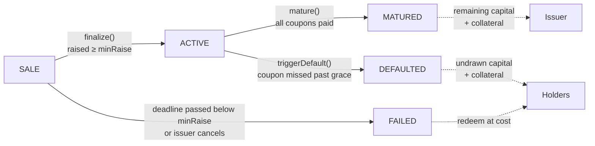
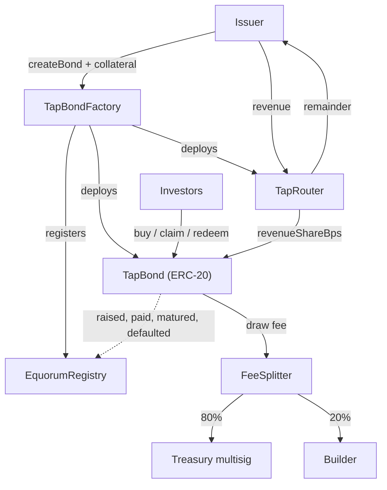

# Equorum Revenue Bonds — Whitepaper V3

**Version 3.0 — September 2026**

**Networks:** Arbitrum Sepolia (V3, deployed and running) · Arbitrum One (V2, legacy)
**Website:** https://equorumprotocol.org
**Source:** https://github.com/EquorumProtocol/Equorum-Revenue-Bonds

> **Status.** V3 is deployed to Arbitrum Sepolia and has completed one end-to-end run on
> chain. It has **not** been audited externally and is **not** on mainnet. V2 remains
> deployed on Arbitrum One and is superseded — see [V2, and why it was replaced](#v2-and-why-it-was-replaced).

---

## Table of Contents

1. [Summary](#summary)
2. [The problem](#the-problem)
3. [The Tap Bond](#the-tap-bond)
4. [What this actually guarantees](#what-this-actually-guarantees)
5. [Fees](#fees)
6. [Reputation: facts, not scores](#reputation-facts-not-scores)
7. [Architecture](#architecture)
8. [Security](#security)
9. [First live run](#first-live-run)
10. [V2, and why it was replaced](#v2-and-why-it-was-replaced)
11. [Getting started](#getting-started)
12. [FAQ](#faq)
13. [Contract addresses](#contract-addresses)
14. [Disclaimer](#disclaimer)

---

## Summary

Equorum lets a protocol that earns revenue raise capital against it, without selling tokens
and without a lender.

The instrument is the **Tap Bond**: an ERC-20 bond sold for ETH, where the ETH sits in
escrow and the issuer draws it down in tranches. Each tranche unlocks only after the issuer
has paid the coupons due so far. Miss a coupon past the grace period and anyone — including
a bondholder — can close the tap permanently; the undrawn capital and any posted collateral
go back to holders, who burn their bonds to claim.

This does not force anyone to pay. Nothing on chain can. What it does is make the worst case
a number you can compute before you buy, and make continuing to pay worth more to the issuer
than walking away — until near the end of the term, where only collateral helps. Both of
those limits are stated plainly in this document rather than buried.

---

## The problem

### For issuers

| Option | Cost |
|---|---|
| Sell tokens | Dilution and sell pressure |
| Venture debt | Centralised, slow, legal overhead |
| Sell treasury assets | Forced disposal at whatever price the market gives |
| Off-chain revenue sharing | Manual, opaque, no secondary market |

### For investors

Opaque accounting, no liquidity until the agreement ends, minimums that exclude small
participants, and — the one that matters — no enforcement. An off-chain revenue-share
agreement with an anonymous protocol is a promise with no remedy behind it.

### The constraint nobody escapes

Without outside collateral, **the issuer's net funding and the investors' unprotected
exposure are the same number.** Every wei the issuer can spend is a wei the investors can
lose. No mechanism removes that trade-off; a court could, but there is no court here.

What a design *can* do is control how that exposure grows, cap it at a level agreed in
advance, and make the exit mechanical rather than discretionary. That is what the tap does.

---

## The Tap Bond


```mermaid
flowchart LR
    SALE -->|"finalize()<br/>raised ≥ minRaise"| ACTIVE
    SALE -->|"deadline passed below minRaise<br/>or issuer cancels"| FAILED
    ACTIVE -->|"mature()<br/>all coupons paid"| MATURED
    ACTIVE -->|"triggerDefault()<br/>coupon missed past grace"| DEFAULTED
    FAILED -.->|"redeem at cost"| H["Holders"]
    DEFAULTED -.->|"undrawn capital<br/>+ collateral"| H
    MATURED -.->|"remaining capital<br/>+ collateral"| I["Issuer"]
```

### Terms, fixed at creation

| Parameter | Meaning | Limits |
|---|---|---|
| `price` | Wei per token | > 0, immutable |
| `maxSupply` | Maximum tokens sold | ≥ 1 token |
| `minRaise` | Soft cap. Below it the sale fails and everyone is refunded. | > 0, ≤ max raise |
| `saleDuration` | Sale window | 1–90 days |
| `epochDuration` | Coupon period | 1–90 days |
| `numEpochs` (N) | Term length in epochs | 1–120 |
| `gracePeriod` | Slack before a missed coupon becomes a default | ≤ `epochDuration` |
| `couponBps` | Minimum payment per epoch, in bps of the raise | 1–10000, and `couponBps × N ≥ 10000` |
| `initialReleaseBps` | Share drawable immediately after the sale | 0–10000 |
| `tapEpochs` | Epochs over which the rest unlocks | 1–N |
| `revenueShareBps` | Router split to holders (0 disables the router) | 0–5000 |
| collateral | Extra ETH posted at creation, paid to holders on default | any, including 0 |

`couponBps × N ≥ 10000` is enforced in the constructor: an issuer that reaches maturity has
returned **at least 100% of the raise**. Yield is whatever it offered above that minimum,
plus the revenue share.

Nothing on this list can be changed afterwards — not by the issuer, not by the multisig, not
by the builder.

### Sale

`buy(amount)` mints tokens against ETH at the fixed price, charging `ceil(amount × price / 1e18)`
so that rounding never hands out free tokens. The issuer holds **zero** tokens at creation,
so it cannot pay coupons to itself to manufacture a payment history.

`finalize()` can be called by anyone once the sale sells out or the deadline passes; the
issuer may close early once `minRaise` is met. Below `minRaise` the bond becomes `FAILED` and
every buyer redeems at cost.

### Coupons

`distribute()` is payable and permissionless: it spreads ETH across current holders pro-rata
using a reward-per-token accumulator with remainder carry, so nothing is lost to rounding and
a transfer mid-term moves the future claim with the tokens.

```
couponAmount   = ceil(raised × couponBps / 10000)     // fixed at finalization
epochsCovered  = totalPaid / couponAmount
epochsDue(t)   = min(N, floor((t − start − grace) / epochDuration))
```

Every wei paid while `ACTIVE` counts toward coupons, so paying early prepays future epochs.

### The tap

```
k        = min(epochsElapsed, epochsCovered, tapEpochs)
unlocked = raised × initialReleaseBps / 10000
         + (raised − initialPart) × k / tapEpochs
```

`drawCapital(to)` withdraws `unlocked − drawn` and is issuer-only. The protocol fee comes out
of each draw. Note the three-way minimum: prepaying coupons does not pull capital forward
past the calendar, and missing coupons stalls the tap even if time has passed.

**Worked example.** Raise 100 ETH, 25% initial release, `tapEpochs` 3, N = 12 monthly epochs,
`couponBps` 10% (1.2× over the term).

| After epoch | Drawn | Paid | Issuer net funding = holder exposure |
|---|---|---|---|
| 0 | 25 | 0 | 25 |
| 1 | 50 | 10 | 40 |
| 2 | 75 | 20 | 55 |
| 3 | 100 | 30 | **70 (peak)** |
| 6 | 100 | 60 | 40 |
| 12 | 100 | 120 | −20 (holders up 20%, plus revenue share) |

Exposure rises, peaks on a known date, then falls. The peak is the most an issuer can walk
away with, and it is computable from the terms before anyone buys. It holds even against an
issuer paying coupons out of the money it just drew: that buys time, not profit, because the
amount it can keep is still `drawn − paid`.

Default after epoch 1 and holders keep the 10 ETH already paid, then redeem the 50 undrawn
ETH plus collateral. In this example, 25 ETH of collateral would cover the initial draw
completely.

### Default

`triggerDefault()` is open to anyone once `epochsDue > epochsCovered`.

1. The state becomes `DEFAULTED` and the tap closes for good.
2. `recoveryPool = (raised − drawn) + collateral`.
3. `redeem()` burns the caller's whole balance and pays `recoveryPool × balance / supplyAtDefault`.
4. The default is written to the registry permanently. Nobody can remove it.

Revenue already earned stays claimable. The router keeps paying the revenue share until the
original maturity date, but only to tokens that still exist — redeeming burns yours and ends
your share.

### Maturity

`mature()` is open to anyone once the term is over and all N coupons are covered. The issuer
then draws whatever capital remains and withdraws its collateral. Tokens stay transferable;
later distributions are voluntary extras.

---

## What this actually guarantees

**Enforced by code:**

- Undrawn capital and collateral can only reach holders (default or failed sale) or the
  issuer (maturity). There is no path to anyone else.
- The issuer cannot draw faster than its own payment record allows.
- Terms are immutable after creation.
- Default is permissionless. No vote, no multisig, no counterparty has to agree.

**Not guaranteed, and worth reading twice:**

- **Capital already drawn.** Beyond posted collateral, it is gone if the issuer defaults.
  The tap bounds this; it does not eliminate it.
- **The last tranche.** Near the end of the term the undrawn remainder approaches zero, so
  the incentive the tap creates fades. Collateral is the only thing covering that window —
  the same reason construction contracts hold a retainage after delivery.
- **The revenue share.** The issuer decides what flows through the router until Locked
  Revenue ships.
- **Legal enforceability.** Revenue-linked tokens may be regulated as securities in many
  jurisdictions, including Brazil (CVM Parecer de Orientação 40) and the United States.

---

## Fees

The **only** protocol fee is the draw fee: a percentage of capital the issuer actually
draws. Deployed at 2%, hard-capped at 3% in the contract. There is no fee on a failed sale,
none on capital returned after a default, and none on coupons — the protocol earns when the
issuer actually receives funding, and not before.

The rate is snapshotted into each bond at creation, so later changes never touch existing
bonds.

`FeeSplitter` splits every fee **80% to the treasury (multisig) and 20% to the builder**.
`BUILDER_SHARE_BPS = 2000` is a compile-time constant: the treasury cannot change the
builder's share, the builder cannot change the treasury's, and each party can rotate only
its own address. Payouts are pull-based and always go to the current address on record.

---

## Reputation: facts, not scores

V2 computed a 0–100 score that anyone could farm for the price of gas. V3 records facts and
lets frontends judge:

`bondsIssued`, `bondsMatured`, `bondsDefaulted`, `totalRaised`, `totalPaid`, `lastDefaultAt`.

Only bonds deployed by an approved factory can write, and each bond is authorised
automatically when the factory registers it. Records are append-only — the owner can approve or
revoke factories and nothing else, and revoking only stops new registrations; bonds already
registered keep writing. There is no blacklist and no way to erase a default.

**Remaining weakness, stated openly:** an issuer can still buy its own bond to inflate
`totalRaised`. That now costs the draw fee on the whole raise instead of just gas, but it is
not impossible. Read history by counterparty, not by volume.

---

## Architecture

| Contract | Role | Admin power |
|---|---|---|
| `TapBond` | ERC-20 bond: sale, escrow, tap, coupons, default, redemption | **None.** All terms immutable. |
| `TapRouter` | Optional. Splits incoming revenue between holders and issuer. | **None.** No owner, no pause. |
| `TapBondFactory` | Validates terms, deploys bond and router, registers the bond | Owner sets the draw fee within the 3% cap and can pause *new* creation. Cannot touch existing bonds. |
| `EquorumRegistry` | Append-only issuer history | Owner approves or revokes factories. Cannot edit records or blacklist. |
| `FeeSplitter` | Receives fees, splits 80/20 | **None.** The split is a constant. |


```mermaid
flowchart TB
    ISS["Issuer"] -->|createBond + collateral| F["TapBondFactory"]
    F -->|deploys| B["TapBond (ERC-20)"]
    F -->|deploys| R["TapRouter"]
    F -->|registers| REG["EquorumRegistry"]
    INV["Investors"] -->|buy / claim / redeem| B
    B -->|draw fee| FS["FeeSplitter"]
    FS -->|80%| T["Treasury multisig"]
    FS -->|20%| BD["Builder"]
    B -.->|raised, paid, matured, defaulted| REG
    ISS -->|revenue| R
    R -->|revenueShareBps| B
    R -->|remainder| ISS
```

Every contract is under the 24 KB limit without proxies or deployer indirection, so what is
on chain is what is in the repository.

---

## Security

### Test suite

69 unit tests, 1 fuzz test, and 6 invariant properties run from two starting states — an open
sale, and a fully-sold bond at the start of its term. `forge test` is the only tool required.

| Suite | What it covers |
|---|---|
| `TapBond.t.sol` (34) | Sale rounding, finalize paths, tap formula, coupons, default, maturity, transfers |
| `RouterFactorySplitter.t.sol` (21) | Router splits, factory validation and pause, registry write rules, the 80/20 split |
| `V2Regression.t.sol` (15) | Six V2 issues reproduced against the real V2 contracts, with the V3 behaviour beside each |
| `TapBondInvariant.t.sol` (6 × 2) | Solvency, draw ≤ raised, recovery never overpaid, revenue never over-claimed, tap never ahead of the coupon record |

Each property runs 128 random call sequences from each starting state — 8,192 and 32,768
calls in total — with **zero reverts**: every generated sequence was a legal one, and the
properties held across all of them.

### Audit status

**No external audit.** Two internal review rounds were done on V2; V3 was written after a
line-by-line review of V2 that produced the R-1…R-10 list below; every item except R-9 is
covered by an executable test. That is not a substitute for an audit, and no mainnet
deployment should happen before one.

### Threat model

| Threat | Mitigation | Residual risk |
|---|---|---|
| Smart contract bug | 70 tests, 6 invariant properties from 2 states, open source | **Medium — no external audit** |
| Issuer stops paying | Tap closes; undrawn capital + collateral returned | **Medium.** Capital already drawn is lost beyond collateral |
| Issuer defaults at the end of the term | Collateral only | **High without collateral** |
| Issuer routes no revenue | Coupon minimum is still enforced by the tap | Medium |
| Issuer farms its own reputation | Draw fee makes it costly; registry records money, not counts | Low–Medium |
| Reentrancy | ReentrancyGuard, pull-based claims | Low |
| Overflow | Solidity 0.8.24 | Very low |
| Multisig turns hostile | Cannot touch existing bonds, funds, or records | Low |
| Holder contract cannot receive ETH | Claims are pull-based, so one stuck holder never blocks others | Low (documented, not fixed) |

---

## First live run

On 15 September 2026 the V3 contracts were deployed to Arbitrum Sepolia and `SmokeV3.s.sol`
ran the full cycle on chain in nine transactions: create bond with collateral, buy the whole
sale, close early, draw the initial release with the fee, pay a coupon, route revenue,
claim.

State read back from the contracts afterwards:

| Read | Value |
|---|---|
| `state` | Active |
| `raised` | 1e15 wei |
| `collateral` | 1e14 wei, locked |
| `epochsCovered` | 1 |
| ETH held by the bond | 8.5e14 wei — undrawn raise plus collateral |
| ETH held by the router | 0 — routed and drained |
| `FeeSplitter` owed | 4e12 treasury / 1e12 builder — 80/20 to the wei |
| Registry record | issuer, factory, 1e15 raised, 1.3e14 paid |

That last row is the point: in V2 a default never reached the registry at all. Here the
record exists from the first transaction and cannot be removed.

Addresses are in [DEPLOYMENTS.md](./DEPLOYMENTS.md).

---

## V2, and why it was replaced

V2 offered two instruments. Both had a flaw that the Tap Bond exists to fix.

**The Guaranteed Bond raised zero net capital.** The issuer deposited the full principal
before selling, buyers' ETH went straight to the issuer, and the deposit returned to buyers
at maturity. The issuer locked 500 ETH to receive 500 ETH — and paid a revenue share and a
2% fee on top. The guarantee was real precisely because the capital never financed anything.

**The Soft Bond had the opposite problem.** Nothing obliged the issuer to pay. The router
protected only what the issuer chose to send it.

Both live on Arbitrum One and will keep working; they are not upgradeable and nobody can
switch them off. **Do not create new V2 Guaranteed Bonds.**

For the record, and because the point of this section is honesty: the V2 mainnet factories
have never issued a series. The only series ever created on Equorum is `UNDERDOG-RB`, a V1
demo from the author's own protocol, with a single holder and 0.003 ETH of revenue ever
distributed. Equorum has no production track record to point at yet.

### The issue list

Six of these (R-1, R-2, R-3, R-4, R-6, R-7) are reproduced against the real V2 contracts in
`test/foundry/V2Regression.t.sol` and paired with the V3 behaviour. R-5, R-8 and R-10 have a
V3-side test only. R-9 is handled by construction — the router has no owner to pause it — and
has no test of its own.

| # | V2 issue | V3 |
|---|---|---|
| R-1 | Registry authorisation was owner-only, so factory calls failed silently — escrow defaults were **never recorded** | Factory registration auto-authorises each bond |
| R-2 | Escrow creation fee skipped when `msg.value == 0` | No creation fee; the fee is taken inside `drawCapital` and cannot be bypassed |
| R-3 | 2% sale fee went to a treasury address the issuer chose | Recipient is the factory's immutable `FeeSplitter` |
| R-4 | A per-address `principalClaimed` flag locked principal on tokens received after claiming | Burn-based redemption, no per-address flag |
| R-5 | Revenue owed to contracts that cannot receive ETH is stuck | **Not fixed, documented.** Pull-based claims keep others unaffected |
| R-6 | Guaranteed Bond raised zero net capital | Replaced by the tap |
| R-7 | Issuer held 100% of supply and could farm reputation by paying itself | Supply is minted only against ETH during the sale |
| R-8 | Issuer could raise the sale price in front of a buyer | Price is immutable |
| R-9 | Router owner could pause routing; 1-wei deposits could block withdrawals | Router has no owner and no pause |
| R-10 | ERC-20 transfers reverted below a minimum balance | Plain ERC-20, no transfer restrictions |

---

## Getting started

### For issuers

1. Model the schedule first. Ask whether a bad month covers the coupon, not a good one.
2. Choose `initialReleaseBps` and `tapEpochs` honestly — they set how much of your buyers'
   money is at risk and for how long.
3. Post collateral if you want the last tranche to mean anything.
4. Create the bond through the factory. Collateral is `msg.value` at creation.
5. Pay coupons on schedule. Each one unlocks the next tranche.

### For investors

1. Read `initialReleaseBps` — that is your unprotected exposure on day one.
2. Compute the exposure peak from the terms. It is arithmetic, not a forecast.
3. Check the collateral and the registry history of the issuer.
4. Remember that a contract cannot tell you whether a team will still exist in nine months.

### For developers

```bash
git clone https://github.com/EquorumProtocol/Equorum-Revenue-Bonds
cd Equorum-Revenue-Bonds
git submodule update --init
forge test
forge script script/DeployV3.s.sol --rpc-url arbitrum_sepolia --account deployer --broadcast
```

---

## FAQ

**What is a Tap Bond?**
An ERC-20 bond whose sale proceeds sit in escrow and are released to the issuer in tranches,
each gated on coupons actually paid.

**Does this force an issuer to pay?**
No. Nothing on chain can. It bounds what a non-paying issuer keeps, makes that bound
computable in advance, and makes the exit permissionless.

**What is the worst case for a buyer?**
The exposure peak in the tap table — drawn minus paid at its maximum — less any collateral.
Both come from the bond's own terms.

**Can I sell my bond?**
Yes. Plain ERC-20, no transfer restrictions, and the revenue claim travels with the token.

**What does it cost to issue?**
Gas, plus the draw fee on capital you actually draw (2%, capped at 3% by the contract). A
failed sale costs no protocol fee.

**Can terms change after creation?**
No. Not by the issuer, the multisig, or the builder.

**Who controls the protocol?**
A multisig owns the factory and registry. It can approve factories, set the draw fee within
the hard cap, and pause new bond creation. It cannot touch an existing bond, its funds, or a
registry record.

**Is it audited?**
No external audit. See [Security](#security).

**Is V2 still usable?**
It is still deployed and still works. Do not create new V2 Guaranteed Bonds — they raise
nothing.

---

## Contract addresses

### V3 — Arbitrum Sepolia (testnet)

| Contract | Address |
|---|---|
| TapBondFactory | `0xFfBDc68D5548C6dA3A04EE2BdE4690827f3736b5` |
| EquorumRegistry | `0x4338Fa9b8AD073106f951a2697CaEB0f55253D40` |
| FeeSplitter | `0xa6160C5Efdac6861229e7E8C88726D9B902ee499` |

V3 is **not deployed on mainnet.**

### V2 — Arbitrum One (legacy)

| Contract | Address |
|---|---|
| RevenueSeriesFactory | `0x280E83c47E243267753B7E2f322f55c52d4D2C3a` |
| RevenueBondEscrowFactory | `0x2CfE9a33050EB77fC124ec3eAac4fA4D687bE650` |
| ProtocolReputationRegistry | `0xfe0A22D77fdf98cC556CBc2dC6B3749EBa4E89bA` |
| Treasury / owner (Safe) | `0xBa69aEd75E8562f9D23064aEBb21683202c5279B` |

### V1 — Arbitrum One (deprecated)

| Contract | Address |
|---|---|
| Factory | `0x8afA0318363FfBc29Cc28B3C98d9139C08Af737b` |
| Genesis series (`UNDERDOG-RB`) | `0x88122C5805281bAbF3B172fA212a6F6300Bb1EF3` |

The full list, including the bond and router created by the live smoke test, is in
[DEPLOYMENTS.md](./DEPLOYMENTS.md).

---

## Disclaimer

1. **Experimental.** No external audit. Use at your own risk.
2. **No guarantees** of revenue, return, or token value.
3. **Not financial or legal advice.** This document is informational.
4. **Regulatory uncertainty.** Revenue-linked tokens may be securities in your jurisdiction.
5. **Smart contract risk.** Bugs can cause total loss.
6. **No liability.** The authors assume none.
7. **Examples are illustrative**, not projections.

---

**Version:** 3.0 · **Last updated:** September 2026 · **License:** MIT
**Contact:** leonardomondaine@gmail.com (issuers, developers) · suport@equorumprotocol.org (support)
