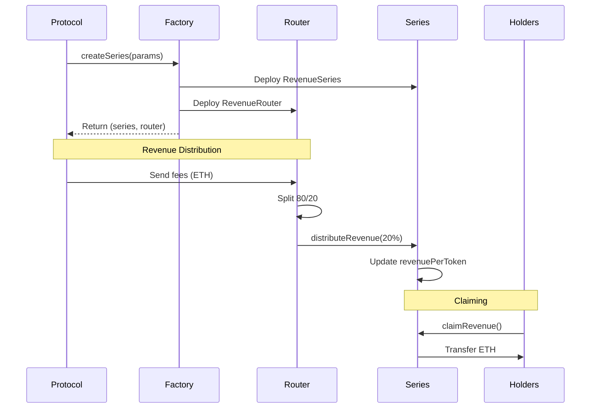

# Integration Guide

**Integrate Revenue Bonds in 10 minutes**

## Overview

Revenue Bonds allows protocols to create tokenized revenue streams that automatically distribute fees to holders. This guide shows you how to integrate it into your protocol.

## Contract Addresses (Arbitrum One)

| Contract | Address |
|----------|---------|
| **RevenueSeriesFactory** (Soft Bonds) | `0x280E83c47E243267753B7E2f322f55c52d4D2C3a` |
| **RevenueBondEscrowFactory** (Guaranteed Bonds) | `0x2CfE9a33050EB77fC124ec3eAac4fA4D687bE650` |

## Choose Your Bond Type

| | Soft Bond | Guaranteed Bond |
|---|---|---|
| **Principal** | None | Locked in escrow |
| **Risk** | Higher (trust-based) | Lower (principal protected) |
| **Token minting** | At creation | After principal deposit |
| **Sale** | Off-chain / DEX | Built-in buyTokens() |
| **Best for** | Established protocols | New protocols building trust |

## Flow Diagram



## Step 1: Deploy a Revenue Series (2 minutes)

```solidity
// Import the factory interface
import "@equorum/contracts/interfaces/IRevenueSeriesFactory.sol";

// Factory address (mainnet/testnet)
address constant FACTORY = 0x...;

function createRevenueSeries() external returns (address series, address router) {
    IRevenueSeriesFactory factory = IRevenueSeriesFactory(FACTORY);
    
    (series, router) = factory.createSeries(
        "Protocol Revenue Q1 2026",  // Name
        "PROTO-Q1-26",               // Symbol
        address(this),                // Protocol address (receives 80%)
        2000,                         // 2000 BPS = 20% to series
        90,                           // 90 days maturity
        1_000_000e18                  // 1M tokens total supply
    );
    
    // Store these addresses for later use
    protocolSeries = series;
    protocolRouter = router;
}
```

**Parameters explained:**
- `revenueShareBPS`: Basis points to series (2000 = 20% to series, 80% to protocol)
- `durationDays`: How long before series matures (can't distribute after maturity)
- `totalSupply`: Total tokens minted (protocol receives all initially)

## Step 2: Distribute Tokens to Stakeholders (1 minute)

```solidity
import "@openzeppelin/contracts/token/ERC20/IERC20.sol";

function distributeTokens() external onlyOwner {
    IERC20 series = IERC20(protocolSeries);
    
    // Distribute to early supporters, investors, team, etc.
    series.transfer(earlySupporter1, 100_000e18);  // 10%
    series.transfer(earlySupporter2, 200_000e18);  // 20%
    series.transfer(investor1, 150_000e18);        // 15%
    
    // Protocol keeps remaining 55% (550k tokens)
}
```

## Step 3: Route Revenue to Series (3 minutes)

### Option A: Direct Transfer (Simplest)

```solidity
function collectAndDistributeFees() external {
    uint256 fees = address(this).balance;
    
    // Send fees to router
    (bool success, ) = protocolRouter.call{value: fees}("");
    require(success, "Transfer failed");
    
    // Router automatically splits 80/20 and distributes
    IRevenueRouter(protocolRouter).routeRevenue();
}
```

### Option B: Batch Multiple Fee Sources

```solidity
function batchCollectFees() external {
    // Collect from multiple sources
    uint256 tradingFees = collectTradingFees();
    uint256 liquidationFees = collectLiquidationFees();
    uint256 protocolFees = collectProtocolFees();
    
    uint256 totalFees = tradingFees + liquidationFees + protocolFees;
    
    // Send to router
    (bool success, ) = protocolRouter.call{value: totalFees}("");
    require(success, "Transfer failed");
    
    // Route to series
    IRevenueRouter(protocolRouter).routeRevenue();
}
```

### Option C: Automated via Keeper/Cron

```solidity
// Called by Chainlink Keeper or Gelato every 24h
function automatedRevenueDistribution() external {
    require(msg.sender == keeper, "Only keeper");
    
    if (address(protocolRouter).balance > minThreshold) {
        IRevenueRouter(protocolRouter).routeRevenue();
    }
}
```

## Step 4: Holders Claim Rewards (1 minute)

Holders can claim anytime:

```solidity
// Frontend integration
function claimMyRewards() external {
    IRevenueSeries(protocolSeries).claimRevenue();
}

// Check claimable amount before claiming
function getClaimableAmount(address holder) external view returns (uint256) {
    return IRevenueSeries(protocolSeries).calculateClaimable(holder);
}
```

## Step 5: Protocol Withdraws Its Share (2 minutes)

Protocol can withdraw its 80% share anytime:

```solidity
function withdrawProtocolRevenue() external onlyOwner {
    IRevenueRouter router = IRevenueRouter(protocolRouter);
    
    // Withdraw all accumulated protocol revenue
    router.withdrawAllToProtocol();
    
    // Funds are now in protocol treasury
}
```

## Advanced: Multiple Series

Create multiple series for different purposes:

```solidity
struct RevenueSeries {
    address series;
    address router;
    string purpose;
}

mapping(uint256 => RevenueSeries) public series;
uint256 public seriesCount;

function createQuarterlySeries(string memory quarter) external onlyOwner {
    (address s, address r) = factory.createSeries(
        string(abi.encodePacked("Revenue ", quarter)),
        string(abi.encodePacked("REV-", quarter)),
        address(this),
        2000,
        90,
        1_000_000e18
    );
    
    series[seriesCount++] = RevenueSeries(s, r, quarter);
}

function routeToAllSeries() external {
    uint256 feePerSeries = address(this).balance / seriesCount;
    
    for (uint256 i = 0; i < seriesCount; i++) {
        (bool success, ) = series[i].router.call{value: feePerSeries}("");
        require(success);
        IRevenueRouter(series[i].router).routeRevenue();
    }
}
```

## Emergency Functions

### Pause Revenue Distribution

```solidity
// If series needs to mature early
function matureSeries() external onlyOwner {
    IRevenueSeries(protocolSeries).matureSeries();
    // No more distributions possible after this
}
```

### Withdraw Stuck Funds

```solidity
// If funds get stuck in router (e.g., series reverts)
function emergencyWithdraw() external onlyOwner {
    IRevenueRouter router = IRevenueRouter(protocolRouter);
    router.emergencyWithdraw();
}
```

## Testing Your Integration

```javascript
// Hardhat test example
describe("Protocol Integration", function() {
  it("Should distribute revenue correctly", async function() {
    const [protocol, holder1, holder2] = await ethers.getSigners();
    
    // 1. Create series
    const tx = await factory.createSeries(...);
    const receipt = await tx.wait();
    const { series, router } = parseSeriesCreatedEvent(receipt);
    
    // 2. Distribute tokens
    await series.transfer(holder1.address, ethers.parseEther("300000"));
    await series.transfer(holder2.address, ethers.parseEther("200000"));
    
    // 3. Send revenue
    await protocol.sendTransaction({ to: router, value: ethers.parseEther("10") });
    await router.routeRevenue();
    
    // 4. Verify claimable
    const holder1Claimable = await series.calculateClaimable(holder1.address);
    expect(holder1Claimable).to.equal(ethers.parseEther("0.6")); // 30% of 2 ETH
    
    // 5. Claim
    await series.connect(holder1).claimRevenue();
    // holder1 now has 0.6 ETH
  });
});
```

## Gas Costs

| Operation | Gas Cost | Notes |
|-----------|----------|-------|
| Create Series | ~3.5M | One-time cost |
| Transfer tokens | ~50k | Constant, even with 5000+ holders |
| Route revenue | ~120k | Splits and distributes |
| Claim revenue | ~95k | Per holder |
| Withdraw protocol share | ~45k | Protocol withdrawal |

## Common Patterns

### Pattern 1: Weekly Distribution

```solidity
uint256 public lastDistribution;
uint256 constant WEEK = 7 days;

function weeklyDistribution() external {
    require(block.timestamp >= lastDistribution + WEEK, "Too soon");
    
    uint256 fees = collectWeeklyFees();
    (bool success, ) = protocolRouter.call{value: fees}("");
    require(success);
    
    IRevenueRouter(protocolRouter).routeRevenue();
    lastDistribution = block.timestamp;
}
```

### Pattern 2: Threshold-Based

```solidity
uint256 constant MIN_DISTRIBUTION = 1 ether;

function distributeIfThresholdMet() external {
    uint256 balance = address(protocolRouter).balance;
    
    if (balance >= MIN_DISTRIBUTION) {
        IRevenueRouter(protocolRouter).routeRevenue();
    }
}
```

### Pattern 3: Event-Triggered

```solidity
function onTradeExecuted(uint256 feeAmount) internal {
    // Accumulate fees
    pendingFees += feeAmount;
    
    // Distribute when accumulated enough
    if (pendingFees >= distributionThreshold) {
        (bool success, ) = protocolRouter.call{value: pendingFees}("");
        require(success);
        IRevenueRouter(protocolRouter).routeRevenue();
        pendingFees = 0;
    }
}
```

---

## Guaranteed Bonds (Escrow) Integration

### Step 1: Create a Guaranteed Bond Series

```solidity
address constant ESCROW_FACTORY = 0x2CfE9a33050EB77fC124ec3eAac4fA4D687bE650;

function createGuaranteedBond() external returns (address escrow, address router) {
    IRevenueBondEscrowFactory factory = IRevenueBondEscrowFactory(ESCROW_FACTORY);

    (escrow, router) = factory.createEscrowSeries(
        "Protocol Guaranteed Bond Q1",  // Name
        "PROTO-GB-Q1",                  // Symbol
        address(this),                  // Protocol (must be msg.sender)
        2000,                           // 20% revenue share
        180,                            // 180 days
        1_000_000e18,                   // 1M tokens
        500 ether,                      // 500 ETH principal
        0.001 ether,                    // Min distribution
        30                              // 30 days deposit deadline
    );
    // State: PendingPrincipal (no tokens minted yet)
}
```

### Step 2: Deposit Principal

```solidity
function depositPrincipal() external onlyOwner {
    // Must send exact principalAmount
    IRevenueBondEscrow(escrowAddress).depositPrincipal{value: 500 ether}();
    // State: Active
    // 1M tokens minted to protocol
    // 500 ETH locked in contract until maturity
}
```

### Step 3: Start Token Sale

```solidity
function startBondSale() external onlyOwner {
    IRevenueBondEscrow escrow = IRevenueBondEscrow(escrowAddress);

    // Set price: 0.0005 ETH per token (500 ETH / 1M tokens)
    escrow.startSale(
        0.0005 ether,    // price per token
        treasuryAddress  // receives 2% sale fee
    );
}
```

### Step 4: Investors Buy Tokens

```solidity
// Frontend: investor buys 10,000 tokens for 5 ETH
function buyBonds(uint256 amount) external payable {
    IRevenueBondEscrow(escrowAddress).buyTokens{value: msg.value}(amount);
    // 2% fee to treasury, 98% to protocol
    // Tokens transferred from protocol to buyer
}
```

### Step 5: Revenue Distribution (Same as Soft Bonds)

```solidity
// Send revenue to router - works identically to Soft Bonds
(bool success, ) = routerAddress.call{value: fees}("");
require(success);
IRevenueRouter(routerAddress).routeRevenue();
```

### Step 6: Investors Claim Revenue + Principal

```solidity
// Claim revenue (anytime during bond lifetime)
IRevenueBondEscrow(escrowAddress).claimRevenue();

// Claim principal (only after maturity)
IRevenueBondEscrow(escrowAddress).claimPrincipal();
// Returns proportional share: (principalAmount * balance) / totalSupply
```

### Guaranteed Bond Gas Costs

| Operation | Gas Cost | Notes |
|-----------|----------|-------|
| Create Escrow Series | ~3.8M | One-time (via deployer pattern) |
| Deposit Principal | ~100k | One-time, activates series |
| Start Sale | ~50k | One-time |
| Buy Tokens | ~120k | Per purchase |
| Route Revenue | ~120-270k | Depends on series state |
| Claim Revenue | ~70k | Per holder |
| Claim Principal | ~60k | Per holder, after maturity |

---

## Troubleshooting

### Issue: "Series matured" error
**Solution**: Series has reached maturity date. Create a new series for future revenue.

### Issue: Router balance not decreasing
**Solution**: Call `routeRevenue()` after sending ETH to router. Router doesn't auto-distribute.

### Issue: Holders can't claim
**Solution**: Ensure `routeRevenue()` was called after sending funds. Check `calculateClaimable()` returns > 0.

### Issue: High gas costs
**Solution**: Batch multiple fee collections before routing. Don't route tiny amounts frequently.

## Support

- Website: [equorumprotocol.org](https://equorumprotocol.org/)
- GitHub: [github.com/EquorumProtocol](https://github.com/EquorumProtocol)
- Discord: [discord.gg/nYMuD8By](https://discord.gg/nYMuD8By)
- Twitter: [@Equorumprotocol](https://x.com/Equorumprotocol)
- Reddit: [r/EquorumProtocol](https://www.reddit.com/r/EquorumProtocol/)

## Next Steps

1. Deploy on testnet first (Arbitrum Sepolia recommended)
2. Test with small amounts
3. Verify all flows work as expected
4. Audit integration code
5. Deploy to mainnet
6. Monitor via events and status functions
