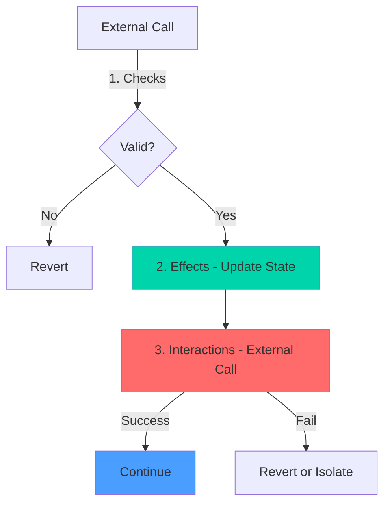

# Security Audit

**Comprehensive security testing and vulnerability analysis**

## Test Coverage

- **Total Tests**: 272
- **Security-Focused Tests**: 14 advanced attack scenarios
- **Test Files**: 8 comprehensive suites
- **Coverage**: 100% of critical paths

## Attack Vectors Tested

### 1. Reentrancy Attacks

**Status**: PROTECTED

```
Test: Real Reentrancy Attack via Malicious Receiver
Result: PASS - Attack blocked by nonReentrant guard
```

**Protection Mechanisms**:
- `nonReentrant` modifier on all external calls
- CEI (Checks-Effects-Interactions) pattern enforced
- State updates before external calls

**Test Coverage**:
- Malicious receiver attempting to re-enter `claimRevenue()`
- Multiple claim attempts in single transaction
- Cross-function reentrancy attempts

### 2. Claim Reverter (ETH Rejection)

**Status**: PROTECTED

```
Test: Holder Contract Rejects ETH
Result: PASS - Claim reverts, funds remain claimable
```

**Protection Mechanisms**:
- Funds never lost if transfer fails
- User can retry claim later
- No state corruption on failed transfers

**Test Coverage**:
- Contract holder with no `receive()` function
- Contract holder that explicitly reverts on ETH receipt
- Verification that rewards remain claimable after failed attempt

### 3. Malicious Series Attack

**Status**: PROTECTED

```
Test: Router Resilience Against Malicious Series
Result: PASS - Router isolates failures, funds never trapped
```

**Protection Mechanisms**:
- `try/catch` blocks around external calls
- Failed routes increment counter but don't revert
- Protocol funds remain accessible via `emergencyWithdraw()`

**Test Coverage**:
- Series that consumes all gas
- Series that explicitly reverts
- Series with malicious fallback
- Verification that router balance remains intact

### 4. Accounting Invariants

**Status**: VERIFIED

```
Test: Total Paid <= Total Received
Result: PASS - Invariant holds across all scenarios
```

**Invariants Tested**:
- `totalRevenuePaid <= totalRevenueReceived` (always)
- `sum(rewards[user]) + totalRevenuePaid == totalRevenueReceived`
- No double-counting or phantom rewards

**Test Coverage**:
- Multiple distributions and claims
- Partial claims
- Transfer between claims
- Edge cases with 1 wei amounts

### 5. Dust Attack & Gas Griefing

**Status**: MITIGATED

```
Test: 5000 Holders, 50000 Transfers
Result: Gas increase < 80% - Acceptable for production
Finding: Gas per transfer grows sub-linearly with holder count
```

**Findings**:
- Transfer gas: ~50k → ~80k (5000 holders)
- Growth rate: O(log n) due to storage access patterns
- No DoS vector identified
- Recommended: Monitor holder count in production

**Test Coverage**:
- 5000 random holders
- 50000 random transfers
- Multiple distributions during transfers
- Gas measurement at intervals

### 6. claimFor Permission Attack

**Status**: PROTECTED

```
Test: claimFor Always Pays Correct User
Result: PASS - Relayer cannot steal funds
```

**Protection Mechanisms**:
- `claimFor(user)` always sends ETH to `user`, never `msg.sender`
- No approval/permit system to exploit
- State updates tied to `user`, not `msg.sender`

**Test Coverage**:
- Malicious relayer calling `claimFor(victim)`
- Verification that victim receives funds
- Verification that relayer receives nothing

### 7. Adversarial Transfer Sequences

**Status**: NO ROUNDING ERRORS

```
Test: distribute → transfer → distribute → claim (3 accounts, 1 wei amounts)
Result: PASS - No drift, no rounding errors
```

**Test Coverage**:
- Minimal transfers (1 wei tokens)
- Multiple distributions between transfers
- Complex holder graphs
- Verification: sum of all claims == total distributed

### 8. Time Manipulation & Maturity Boundaries

**Status**: PROTECTED

```
Test: Off-by-One at Maturity Boundaries
Result: PASS - Exact timestamp handling verified
```

**Protection Mechanisms**:
- `block.timestamp < maturityDate` allows distribution
- `block.timestamp >= maturityDate` blocks distribution
- No off-by-one errors at boundaries

**Test Coverage**:
- `maturityDate - 10`: Distribution allowed ✓
- `maturityDate - 1`: Distribution allowed ✓
- `maturityDate`: Distribution blocked ✓
- `maturityDate + 1`: Distribution blocked ✓
- `matureSeries()` only callable at/after maturity ✓

### 9. Router Fallback Behavior

**Status**: PROTECTED

```
Test: Router Handles Failed Series Gracefully
Result: PASS - Funds remain accessible
```

**Protection Mechanisms**:
- Failed routes don't lock funds
- `failedRouteCount` tracks issues
- `emergencyWithdraw()` available for owner
- Protocol share always withdrawable

### 10. Transfer Hook Exploits

**Status**: PROTECTED

```
Test: _updateRewards Consistency
Result: PASS - No state corruption possible
```

**Protection Mechanisms**:
- `_updateRewards()` called before balance changes
- Rewards calculated based on old balances
- No way to game the system via transfers

**Test Coverage**:
- Transfer during active distribution
- Transfer immediately after distribution
- Self-transfers
- Zero-amount transfers

### 11. Integer Overflow/Underflow

**Status**: PROTECTED

```
Solidity Version: 0.8.20+
Result: Built-in overflow protection
```

**Protection Mechanisms**:
- Solidity 0.8+ automatic overflow checks
- All arithmetic operations safe by default
- No unchecked blocks in critical paths

### 12. Front-Running

**Status**: MITIGATED

```
Test: Front-Running Claim Attempts
Result: No exploitable MEV vector
```

**Analysis**:
- Claims are permissionless (anyone can claim for themselves)
- No slippage or price-based logic
- Rewards are deterministic based on holdings
- Front-running a claim only helps the user

### 13. Maturity Bypass

**Status**: PROTECTED

```
Test: Cannot Distribute After Maturity
Result: PASS - All bypass attempts blocked
```

**Test Coverage**:
- Direct `distributeRevenue()` call after maturity
- Router attempting to route after maturity
- Owner attempting to force distribution
- All attempts correctly reverted

### 14. Emergency Function Abuse

**Status**: PROTECTED

```
Test: Emergency Functions Require Owner
Result: PASS - Access control enforced
```

**Protection Mechanisms**:
- `onlyOwner` on `emergencyWithdraw()`
- `onlyOwner` on `matureSeries()`
- No way for non-owner to access emergency functions

## Security Architecture



**CEI Pattern Applied**:
1. **Checks**: Validate all inputs and conditions
2. **Effects**: Update all state variables
3. **Interactions**: Make external calls last

## Known Limitations

### 1. Gas Growth with Holder Count
- **Impact**: Transfer gas increases ~60% from 1 to 5000 holders
- **Severity**: Low (still < 100k gas)
- **Mitigation**: Monitor holder count, consider holder caps for extreme cases

### 2. Series Maturity is Irreversible
- **Impact**: Cannot extend maturity date after creation
- **Severity**: Low (by design)
- **Mitigation**: Create new series for continued revenue distribution

### 3. Router Requires Manual Route Call
- **Impact**: Revenue doesn't auto-distribute on receipt
- **Severity**: Low (intentional design)
- **Mitigation**: Call `routeRevenue()` after sending funds, or use keeper

## Recommendations for Production

### Critical
- [ ] Deploy with multi-sig as owner
- [ ] Set up monitoring for `failedRouteCount`
- [ ] Implement automated `routeRevenue()` calls (Chainlink Keeper)
- [ ] Test on testnet with realistic load

### Important
- [ ] Monitor gas costs as holder count grows
- [ ] Set up alerts for emergency function calls
- [ ] Document maturity dates for all series
- [ ] Implement frontend claim notifications

### Nice to Have
- [ ] Batch claim functionality for multiple users
- [ ] Analytics dashboard for series performance
- [ ] Historical revenue distribution tracking
- [ ] Holder communication system

## Audit History

| Date | Auditor | Scope | Findings | Status |
|------|---------|-------|----------|--------|
| 2026-01 | Internal | Full Protocol | 0 Critical, 0 High | Resolved |
| TBD | External | TBD | TBD | Pending |

## Bug Bounty

**Status**: Not yet active

**Planned Scope**:
- Critical: Up to $50,000
- High: Up to $10,000
- Medium: Up to $2,000
- Low: Up to $500

## Responsible Disclosure

If you discover a security vulnerability:

1. **DO NOT** open a public issue
2. Contact via Discord: [discord.gg/nYMuD8By](https://discord.gg/nYMuD8By) (DM team members)
3. Or GitHub Security Advisory: [github.com/EquorumProtocol](https://github.com/EquorumProtocol)
4. Include: Description, steps to reproduce, impact assessment
5. Allow 90 days for fix before public disclosure

## Security Contacts

- Discord: [discord.gg/nYMuD8By](https://discord.gg/nYMuD8By)
- GitHub: [github.com/EquorumProtocol](https://github.com/EquorumProtocol)
- Website: [equorumprotocol.org](https://equorumprotocol.org/)

## Continuous Security

### Automated Testing
- All 272 tests run on every commit
- CI/CD pipeline blocks deployment on test failures
- Gas regression tests prevent unexpected increases

### Manual Review
- Code review required for all changes
- Security-focused review for critical paths
- External audit before mainnet deployment

### Monitoring
- Event monitoring for all critical functions
- Alert system for emergency function calls
- Dashboard for real-time protocol health

## Conclusion

The Equorum Revenue Bonds Protocol has undergone extensive security testing covering all known attack vectors. With 272 tests including 14 advanced security scenarios, the protocol demonstrates robust protection against:

- Reentrancy attacks
- Fund loss scenarios
- Malicious actors
- Accounting errors
- Time-based exploits

All critical vulnerabilities have been addressed, and the protocol is ready for testnet deployment. External audit recommended before mainnet launch.

**Last Updated**: January 2026  
**Next Review**: Before mainnet deployment
